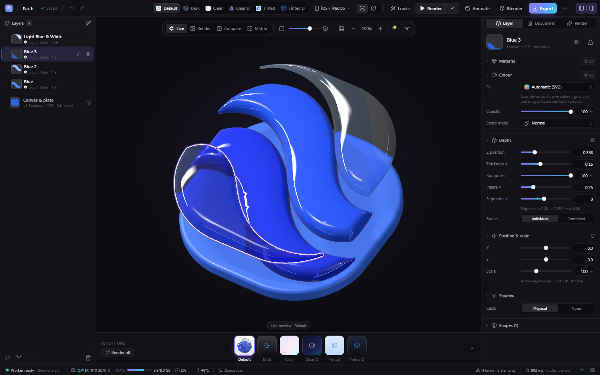
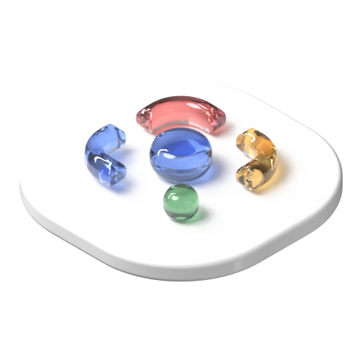
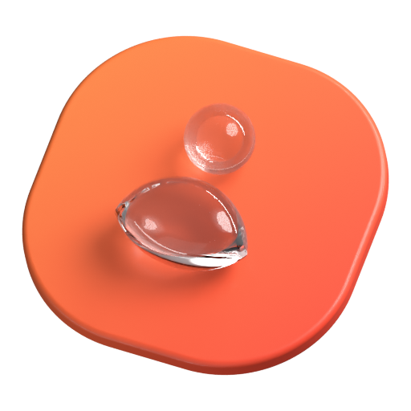
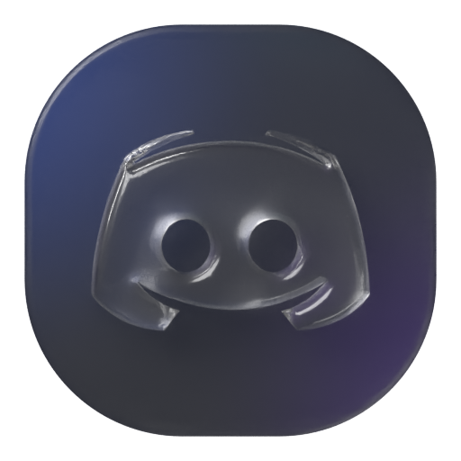

<div align="center">

# Blender Icon Studio

**Flat SVG in. Liquid Glass out.**<br>
Turn flat SVG app icons into layered 3D, glass and Liquid Glass icons. Every shape becomes a real body with
one Principled BSDF, Blender 5.0's Cycles renders the physics on your own GPU, and the result is exported for
every platform.


<sub>Twelve icons from the 68-icon sample corpus, imported as-is, given the Liquid Glass look and rendered by
Cycles + OptiX (preview tier, 256 px each).</sub>

[Quick start](#quick-start) · [Tour](#a-tour-of-the-app) · [Materials](#materials-one-principled-bsdf-per-shape) ·
[3D bodies](#3d-bodies) · [Features](#features) · [GPU notes](#gpu-and-optix-notes) · [Architecture](#architecture) ·
[Development & tests](#development-and-tests) · [Troubleshooting](#troubleshooting)

</div>

---

Blender Icon Studio works like Apple's Icon Composer, with Blender doing the rendering. Drop in an SVG and the
app splits it into depth layers. Every shape becomes a watertight 3D body with a round edge (and, if you want,
a domed top), and every shape gets its own material: **one Principled BSDF, nothing faked**. Cycles does the
physics: refraction, reflections, real shadows and light passing through glass. A three.js view updates
instantly, EEVEE renders a draft in a fraction of a second, and Cycles with OptiX renders the physical result.
One click exports a ready-to-ship icon set for iOS, macOS, watchOS, Android, Windows and the web.

The goal is a convincing 3D object, not a pixel-exact copy of the SVG: clear glass shows what lies beneath it,
and dark glass on a dark plate looks dark.

## Quick start

**You need:** Windows 11 · an NVIDIA RTX GPU (OptiX) · **Blender 5.0** at
`C:\Program Files\Blender Foundation\Blender 5.0\blender.exe` (or set `BIS_BLENDER`) · **Python 3.13**
(the `py` launcher) · **Node.js 22+**.

1. Double-click **`Blender Icon Studio.cmd`**. On the first run it:
   - creates `.venv` and installs `requirements.txt`;
   - runs `npm install` and builds the web UI into `web/dist`;
   - starts the server on <http://127.0.0.1:8420>;
   - opens the app in your default browser — as a chromeless app window for Chromium browsers
     (Brave, Chrome, Vivaldi, Opera, Edge). Override with `scripts/start.ps1 -Browser chrome` (or a path).
2. Pick a sample or drop an SVG anywhere on the home screen.
3. Edit layers, materials and lighting — the live view, the EEVEE draft and the Cycles preview follow.
4. Click **Export**, choose the targets and download the zip.

Close the launcher console to quit; the Blender processes are tied to the server and exit with it, even if the
server is killed. If the server is already running, the launcher just opens a new window.

| Launcher option (`.cmd` or `scripts\start.ps1`) | Effect |
|---|---|
| `-Port <n>` | serve on another port |
| `-NoBrowser` | do not open a window |
| `-Rebuild` / `-SkipBuild` | force / never rebuild the web UI |
| `-Fake` | run without Blender, with flat Pillow previews (UI work without a GPU) |
| `-NoWorker` | start the Blender worker on the first render instead of at startup |

## A tour of the app

### Home — import, samples and Icon Pack


Import an SVG (drag and drop works anywhere), open one of the 68 sample icons in `samle icons/` (plus the
pipeline test files), reopen a recent project or start an **Icon Pack**. The status pill shows the Blender
version and the OptiX GPU.

### The editor


- **Layers** on the left: drag to reorder, merge, split, move elements between layers, hide and lock. Expand a
  layer to see its shapes; click a shape to give it its own material. The *Canvas & plate* row holds the plate
  (the detected source plate becomes a parametric squircle, circle or rounded rectangle).
- **Stage** in the middle, with four views and a view-angle control (Front · slider · Iso):
  - **Live** — an instant three.js preview that mirrors the Blender scene: the same height-field bodies, one
    physical material per shape mapped input by input from its Principled values, the same lighting, camera
    and colour mode.
  - **Render** — the latest Blender render. *Fit* never enlarges a render past its own pixels (a 512 px preview
    is shown at 512 device pixels, centred); the chip under it says `1:1`, or the actual scale when you zoom.
  - **Compare** — drag a divider between the live view and the Blender render.
  - **Matrix** — all six appearances side by side plus a size waterfall (180 → 20 px).
- **Renditions strip** at the bottom: Default, Dark, Clear Light/Dark, Tinted Light/Dark — click to edit one.
- **Inspector** on the right:
  - *Layer* — **Material** (preset picker + the Principled BSDF inputs, see [Materials](#materials-one-principled-bsdf-per-shape)),
    **Colour** (fill overrides with a gradient editor, opacity, blend mode — used by the `.icon` export only),
    **Depth** (Z position, thickness, roundness, inflate, segments, individual / combined bodies, re-stack),
    position & scale, **Shadow** (Physical / None), the layer's **Shapes** and per-appearance overrides.
  - *Document* — platform, plate (shape, fill and its own Principled material), lighting, camera (view angle,
    orthographic / perspective), colour mode and render settings.
- **Status bar**: worker state, OptiX GPU, VRAM, utilisation, the GPU queue and the last render time.

The shot above is the *Contacts* sample in Clear Glass (Roughness 0, IOR 1.6, Transmission 1) at view angle 0.45:
the head is a glass sphere, the body a glass pebble, and the orange plate refracts through both.

### CAD view — head-on to isometric



Press <kbd>X</kbd> (or click **Front** / **Iso**, or drag the view-angle slider in the stage toolbar) to turn the
orthographic camera from head-on toward a true isometric view (pitch 35.264°, yaw 45°), like a CAD program.
Nothing is spread apart: the layers sit at their **real** Z positions, so the depth you see is the depth you
render. The live view and every Blender render share the same camera (`camera.iso`, 0 – 1) and its auto-framing;
the Matrix renditions and the export masters stay head-on. **Animate → Iso sweep** renders head-on → isometric →
head-on.



<sub>*Maps* split into four colour layers (Frosted look, layers 0.12 apart) at full isometric, Cycles preview, 512 px.</sub>

### Six appearances


Icon Composer's six renditions — **Default**, **Dark**, **Clear Light**, **Clear Dark**, **Tinted Light** and
**Tinted Dark** — rendered in one go (<kbd>Shift</kbd>+<kbd>M</kbd>). Appearances change only Principled inputs and
the plate: *Dark* swaps in a dark plate fill; *Clear* turns every shape into white transmissive glass (roughness
0.22) over a frosted plate and a wallpaper; *Tinted* uses the art's luminance × the tint colour as the glass
colour. Dark and mono variants can override fills, opacity, blend mode and materials per layer.


### Icon Pack (batch)


Pick many icons, apply one look (or a style copied from another project) and render them all in one queued job,
with a contact sheet and — optionally — every platform export packed into one zip.

## Materials: one Principled BSDF per shape

<table>
<tr>
<td width="50%"></td>
<td width="50%"></td>
</tr>
<tr>
<td><sub><b>Clear Glass</b> — Roughness 0, IOR 1.6, Transmission 1. The head is as thick as it is wide with
Roundness 100 %, so it is a sphere; the body has a full round edge and Inflate 0.3. View angle 0.45.</sub></td>
<td><sub><b>Frosted Glass</b> — Roughness 0.267, IOR 1.6, Transmission 1, Base Color = the SVG gradient. Inflate 0.3;
the star tips taper cleanly. Head-on.</sub></td>
</tr>
</table>

- **One material per shape.** In Blender every shape object has its own material, named after its layer and
  shape (`BIS <layer> / <shape id>`; the plate is `BIS Plate`). The graph is the layer art (image texture, or a
  gradient / solid fill override) → Mix (white → art, *Art Colour Amount*) → **one Principled BSDF** → Material
  Output. There are no Mix / Add Shader nodes, no Emission / Transparent / Glass / Refraction / Volume shader
  nodes, no light-path tricks and no glow cards — Cycles works out the refraction, reflections and shadows.
- **The Principled inputs are the sliders.** The inspector shows the 28 parameters grouped like Blender's panel:
  *Paint* (use the art colour as Base Color, Emission or both; Art Colour Amount; Surface Grain; Film Variation),
  *Base* (Metallic, Roughness, IOR, Alpha, Diffuse Roughness), *Subsurface*, *Specular*, *Transmission*, *Coat*,
  *Sheen*, *Emission* and *Thin Film*. Groups that do nothing start collapsed and say "off"; every input, group
  and the whole material can be reset. Small pre-processing nodes are added only when used: noise → bump for
  grain, noise → map range for thin-film variation, tint mixes for specular / coat / sheen, a radial tangent for
  brushed metal.
- **Presets are starting values.** 16 presets in `shared/presets.json`: Liquid Glass, Clear, Frosted and Stained
  Glass, Diamond (IOR 2.4 + thin film — the Principled BSDF in Blender 5.0 has no dispersion), Jelly
  (transmission + subsurface), Glossy Plastic, Satin, Hard Candy, Gummy, Matte Clay, Chrome, Anodized Metal,
  Iridescent (thin film), Neon (emission; the glow is the compositor's Glare, a render setting) and Flat (2D).
- **Per-shape materials.** Expand a layer and click a shape (or right-click → *Own material*) to give it its own
  preset and values (`Layer.elementMaterials`). With the layer's preset the shape starts from the layer's values;
  with another preset it starts from that preset's defaults. A layer whose shapes have their own materials
  renders them as separate bodies.
- **Colour modes.** *Brand-exact* (the default: Standard view transform plus a highlight soft clip, so lit opaque
  paint stays close to the SVG), *Neutral* (Khronos PBR Neutral), *Standard*, *Photographic* and *Punchy* (AgX).
  Glass is never pre-compensated: its colour is whatever the physics gives.

## 3D bodies

- **Height-field bodies for every shape.** Each piece (individual mode) or silhouette (combined mode) becomes one
  watertight body over its 2D outline. Its height follows the inward distance *d* from the outline: a flat
  middle, a round edge of radius *bevel*, and an optional dome on top —
  `top z(d) = e + hb(d) + inflate · D · √(1 − (1 − min(d/D, 1))²)`, with `hb(d) = √(b² − (b − min(d, b))²)`,
  `e = max(thickness/2 − b, 0)` and *D* the piece's inradius; the bottom mirrors the top.
- **Thin parts taper instead of breaking.** Because the height is limited by the distance to the edge, star
  tips, thin strokes and sharp corners simply get thinner — no inverted bevels and no self-intersecting edges.
  Across the 68-icon corpus at default, maximum roundness and full inflate: zero self-intersections, zero
  non-manifold edges.
- **Depth controls.** *Z position*, *Thickness*, *Roundness* (the edge radius as a share of half the thickness:
  100 % is a full pill edge, and a round shape as thick as it is wide becomes a sphere), *Inflate* (the dome),
  *Segments* and *Bodies* (individual pieces or one combined silhouette). **Re-stack** spaces the layers so
  their bodies don't touch.
- **How it's built.** In Blender with `mathutils.geometry.delaunay_2d_cdt` (dense, graded boundary rings plus
  interior points, hole-aware) and smooth custom normals, cached per layer and depth settings; the live view
  runs a port of the same algorithm with poly2tri.
- **Physical shadows and light.** *Physical* (the default) is Cycles' true shadow: the body really blocks the
  light, so glass casts a lighter, tinted shadow. *None* turns the object's shadow off. Cycles' refractive and
  reflective caustics are on in every Cycles tier, so light passes through glass instead of leaving a black
  shadow.

## Features

**Import and split**
- Any SVG: drag and drop or the sample library; plain, UTF-16 and gzip-compressed (`.svgz`) files.
  Gradients, opacity, strokes, clip paths and embedded raster images are handled; baked drop-shadow filters
  are recognised; off-canvas junk is culled.
- Smart layer split (smart, group, colour, per element or single), then merge / split / move. Z-order
  validation stops overlapping art from being "woven" through other layers.
- Full-bleed artwork (the art itself is the icon shape) is recognised and labelled *Full-bleed*.

**Light**
- **Lighting rigs**: an angle + elevation dial with Icon Composer's −45° default; presets Studio, Soft,
  Dramatic, Top Light, Dark Field, Golden, Neon Night and Flat.

**Looks and styles**
- **Looks** restyle the whole icon in one click — Liquid Glass, Crystal, Frosted, Prism, Candy, Clay, Chrome,
  Neon, Iridescent and Soft 3D. A look sets every layer's material, depth (thickness, roundness, inflate) and
  shadow, restacks the layers (`z = i × zGap`) and sets the plate material plus, when it defines them, lighting,
  camera, colour mode and tint. Applying a look clears per-shape materials so it shows on every shape. Look
  bevels are clamped to 0.9 × each layer's safe radius. The icon's own plate colour and shape are kept unless
  the look sets them (Neon switches the plate to System Dark).
- **Copy / paste style** between icons (<kbd>Ctrl</kbd>+<kbd>Alt</kbd>+<kbd>C</kbd> / <kbd>V</kbd>): the dominant
  layer material, depth and shadow, each layer's material by stack position, the median layer gap, the plate
  material, lighting, camera, colour mode and tint. A plate *fill* only travels when it's a deliberate System
  Light / System Dark / None fill (`?plateFill=true&shape=true` copies fill and shape anyway). Per-shape
  materials never travel (shape ids belong to one icon).

**Rendering** — all Cycles work runs on the OptiX device:

| Path | Engine | Typical time (RTX 3070 Ti) | Used for |
|---|---|---|---|
| Live | three.js (WebGL) | every frame | layout, materials, lighting and view angle while you drag |
| Draft | EEVEE, 512 px | ~0.3 s warm | automatic after each edit |
| Preview | Cycles + OptiX denoiser, 512 px, 48 spp | ~0.6–1 s | automatic ~1.2 s after edits settle |
| Final / Ultra | Cycles, 1024 / 2048 px | seconds | exports and hero shots (one-shot process) |

EEVEE is a layout draft: it can't show glass through glass. The Cycles preview is the first physical view.

**Export** (one zip):

| Target | What you get |
|---|---|
| iOS / iPadOS | `AppIcon.appiconset`: 1024 universal + dark + tinted luminosity variants and `Contents.json` |
| macOS | `AppIcon.icns`, `AppIcon.iconset` and `AppIcon.appiconset`, with the Tahoe 824/1024 body and transparent margins |
| watchOS | 1024 appiconset + a 1088 circle |
| Android | adaptive icon (foreground layers / background plate / themed monochrome, 108 dp, all densities), legacy square + round mipmaps, the XML, and a 512 Play Store icon |
| Windows | multi-size `app.ico` (16–256) + PNGs |
| Web / PWA | `favicon.ico` (16/32/48), `favicon.svg`, `apple-touch-icon`, 192/512 + maskable icons, `manifest.webmanifest` and a `<head>` snippet |
| Marketing | `hero.png` (three-quarter CAD view, view angle 0.55), `hero-iso.png` (isometric) and `hero-dark.png` — transparent PNGs with the real layer depths |
| Icon Composer | `.icon` bundle (beta): layer SVGs + `icon.json`, groups ordered front→back, dark/tinted specializations; glass, blur and translucency are derived from the Principled values |
| Blender | the `.blend` scene with packed textures |

Platform masters are always rendered head-on.

**Also:** animations (turntable, tilt, float, light sweep, iso sweep) as MP4 (H.264), WebP, GIF or a PNG
sequence · **Icon Pack** batches with progress ("Icon 7/24: Maps"), per-icon failure marking, cancel that
keeps finished icons, and live drafts that keep running between icons · **Open in Blender** saves the scene and
opens it in your Blender GUI (started through WMI on Windows, so it stays open after the server stops) — every
shape's material is an ordinary Principled BSDF you can keep editing there.

<details>
<summary><b>More renders</b> (Cycles preview, 512 px)</summary>

| | | |
|---|---|---|
|  |  |  |
| *Photos* — Liquid Glass look | *Maps* — Candy look, Dark appearance | *Discord* — Clear Dark appearance |

</details>

<details>
<summary><b>Keyboard shortcuts</b></summary>

| Keys | Action |
|---|---|
| <kbd>1</kbd> – <kbd>6</kbd> | switch appearance (Default, Dark, Clear Light, Clear Dark, Tinted Light, Tinted Dark) |
| <kbd>V</kbd> | cycle the stage: Live → Render → Compare → Matrix |
| <kbd>X</kbd> (or <kbd>I</kbd>) | swing the view between top-down and isometric (real layer distances) |
| wheel · middle-drag (or <kbd>Space</kbd>+drag) | zoom at the cursor · pan the view (CAD-style; doesn't change the render framing) |
| <kbd>O</kbd> / <kbd>G</kbd> | front / orbit view · icon grid overlay |
| <kbd>0</kbd> / <kbd>Home</kbd> / <kbd>Ctrl</kbd>+<kbd>0</kbd> / double middle-click | reset the view to fit |
| <kbd>R</kbd> / <kbd>Shift</kbd>+<kbd>R</kbd> | Cycles preview / Final render |
| <kbd>Shift</kbd>+<kbd>M</kbd> | render all six renditions |
| <kbd>Ctrl</kbd>+<kbd>Z</kbd> / <kbd>Ctrl</kbd>+<kbd>Shift</kbd>+<kbd>Z</kbd> | undo / redo |
| <kbd>Ctrl</kbd>+<kbd>G</kbd> · <kbd>H</kbd> · <kbd>Del</kbd> | merge · hide · delete selected layers |
| <kbd>E</kbd> · <kbd>?</kbd> | export · all shortcuts |

</details>

## GPU and OptiX notes

- Cycles always uses the **OptiX** device: the CUDA and CPU device entries are disabled and the **OptiX
  denoiser** is used in every Cycles tier. EEVEE drafts run on the same GPU.
- The GPU is shared with the desktop (an 8 GB card already carries 3.5–4.7 GB from Windows and apps). To stay
  within that:
  - interactive tiers are clamped to **512 px**, and `use_persistent_data` is off;
  - Final (1024 px) and Ultra (2048 px) renders, exports and animations run in **one-shot Blender processes**
    that release their VRAM on exit (cancel = kill);
  - refractive and reflective caustics are on in every Cycles tier (they cost about 0.2 s and need no kernel
    compile); MNEE shadow caustics stay off (a 164 s OptiX kernel compile).
- The first EEVEE render after a driver or Blender update compiles shaders (about 12 s). The worker warms up
  at startup, and the status bar shows *Worker starting…* until it is ready.
- Exports at Final quality render up to 13 master images, one Blender process each (about 2–3 s of start-up per
  image on top of the render). Keep Ultra for hero shots.

## Architecture


- **Projects** live in `workspace/projects/<id>/`: `project.json`, the original and normalised SVG, `cache/`
  (geometry bundles, layer textures and layer SVGs), `renders/<jobId>.png`, `exports/<jobId>.zip` and `blend/`.
  Everything under a project is served at `/files/projects/<id>/…`.
- **Materials on the server:** every project is cleaned on load and save against the Principled schema in
  `shared/presets.json` — unknown parameters are dropped, values are clamped to the slider ranges and old
  parameter names (`frost`, `coat`, `film`, …) are mapped onto Principled inputs, so projects from before the
  single-Principled change still open.
- **Jobs:** one global GPU queue. Live drafts jump ahead and are *coalesced* (a newer live render replaces a
  queued one). A long export pauses between master renders to let live drafts and previews through, so the
  editor stays live. Cancel drops a queued job and kills a running one-shot process; a running draft in the
  persistent worker is marked cancelled at once and its result discarded. Progress streams over `/ws`.
- **Process model (decision D8):** drafts and previews use the warm persistent worker (~0.26 s for a warm
  128 px draft); everything heavy runs in a short-lived Blender process.
- **Data contract:** `server/bis/models.py` ⇄ `web/src/types.ts` (camelCase JSON) and `shared/presets.json`.
- The full plan is in [`docs/PLAN.md`](docs/PLAN.md) (§11 describes the physical-rendering design); the research
  is in [`docs/research/`](docs/research/).

<details>
<summary><b>REST API</b> (prefix <code>/api</code>)</summary>

| Endpoint | Purpose |
|---|---|
| `GET /system`, `GET /system/logs` | status (Blender, worker, GPU, queue) and the tail of the worker's stdout |
| `POST /system/worker/restart` | restart the worker |
| `GET /presets` | material presets with the Principled schema, lighting, platform and quality presets and `looks`, plus swatch URLs |
| `GET /looks` | the named looks `{id: {label, description, style}}` |
| `GET /samples` | the sample library |
| `GET /samples/{name}/thumbnail.png`, `GET /samples/{name}/source.svg` | a sample's thumbnail or raw SVG |
| `GET\|POST /projects` | list projects, or create one (multipart `file`, or JSON `{sample}`) |
| `GET\|PUT\|DELETE /projects/{id}` | read, replace or delete a project |
| `POST /projects/{id}/duplicate` | duplicate a project |
| `GET /projects/{id}/source.svg` | the project's original SVG |
| `POST /projects/{id}/split` | re-split the layers |
| `POST /projects/{id}/layers/merge` | merge layers |
| `POST /projects/{id}/layers/{layerId}/split` | split one layer |
| `POST /projects/{id}/elements/move` | move elements to another layer |
| `GET /projects/{id}/geometry` | the geometry bundle |
| `GET /projects/{id}/style` | copy style → `StyleSpec` (`?plateFill=true&shape=true` also copies the plate fill / shape) |
| `POST /projects/{id}/style` | paste style: exactly one of `{look}`, `{style: StyleSpec}` or `{fromProject}` → the saved `Project` (400 if not exactly one, 404 for an unknown look or project) |
| `GET /projects/{id}/layers/{layerId}/thumbnail.png` | a layer thumbnail |
| `POST /projects/{id}/render` | queue a render → `Job` (an optional `camera` with `iso` 0–1 sets the view angle) |
| `POST /projects/{id}/renditions` | the six appearances → `Job[]` |
| `POST /projects/{id}/animate` | queue an animation → `Job` (`kind`: `tilt`, `turntable`, `float`, `light-sweep`, `iso`) |
| `POST /projects/{id}/export` | queue an export → `Job`; the result holds `zip`, `files` and `previews` |
| `POST /projects/{id}/blend` | save a `.blend` (`{open: true}` launches Blender) → `Job` |
| `POST /batch` | Icon Pack: `BatchRequest` `{sources: [{sample} \| {projectId}], look? \| style? \| fromProject?, strategy, quality, size, appearance, export?}` → `Job` (kind `batch`); the result holds `items` (`BatchItemResult[]`), `contactSheet` and, with `export`, `zip` (files under `/files/batches/<jobId>/`); while it runs (and after a cancel) `result` is partial: `{items, count, failed, partial: true}` |
| `GET /jobs`, `GET /jobs/{id}`, `DELETE /jobs/{id}` | list, read or cancel jobs |
| `WS /ws` | `{type:'job', job}`, `{type:'system', status}` (every 2 s) and `{type:'project', projectId, event}` |

</details>

## Development and tests

```powershell
scripts\dev.ps1                 # API with --reload (new window) + Vite dev server with HMR on :5173
scripts\dev.ps1 -Fake           # the same without Blender (flat Pillow previews)
.venv\Scripts\python.exe -m uvicorn bis.main:app --app-dir server --port 8420   # server only
```

**Run every check with one command:**

```powershell
scripts\test.ps1                # pytest (Blender-free) + node viewport/UI tests + tsc + vite build
scripts\test.ps1 -Blender       # + the real Blender 5.0 suites (OptiX; small draft/preview renders)
scripts\test.ps1 -Only node,tsc # just some steps (pytest, blender, node, tsc, vite)
```

Or step by step:

```powershell
.venv\Scripts\python.exe -m pytest -q tests --ignore=tests/blender       # SVG pipeline, API (fake bridge), exports, styles, batch
.venv\Scripts\python.exe -m pytest -q tests/blender                      # real Blender 5.0 worker
$env:BIS_REAL_BLENDER = '1'; .venv\Scripts\python.exe -m pytest -q tests/test_api_integration.py tests/test_batch.py   # import → draft → export, Icon Pack
node --test web/src/viewport/tests/*.test.mjs web/src/features/editor/inspector/*.test.mjs   # live view ⇄ worker parity, inspector, UI polish
cd web; npx tsc -b --noEmit; npx vite build                              # type check + production build
```

| Suite | What it covers |
|---|---|
| `tests/test_svg_*.py` | the SVG pipeline over the 68-icon corpus: import, split, geometry, units, ops |
| `tests/test_api.py` | REST, WebSocket, the job queue, coalescing, cancel and auto preview, material cleaning of old projects, per-shape materials, with a FakeBridge |
| `tests/test_api_bridge.py` | the real `BlenderBridge` against a stand-in process: handshake, progress, restart, one-shot kill |
| `tests/test_export.py`, `test_style.py`, `test_batch.py` | every export target, the marketing heroes and the `.icon` writer · looks and style transfer · Icon Pack |
| `tests/test_api_integration.py` | the real SVG pipeline, plus opt-in real Blender runs (`BIS_REAL_BLENDER=1`) |
| `tests/blender/` | the worker inside Blender 5.0 (≤ 256 px): one Principled BSDF per shape (graph rules, parameter mapping, glass / shadow physics), height-field bodies (watertight, no self-intersections, corpus), the iso camera and framing, every preset in draft + preview |
| `web/src/viewport/tests/` | the live view against the worker: Principled → three.js material mapping, the height-field port, iso framing, plus the UI polish checks |
| `web/src/features/editor/inspector/` | the Principled inspector: group order and open groups, the per-shape merge rule, Roundness and re-stack |

| Environment variable | Meaning |
|---|---|
| `BIS_BLENDER` | path to `blender.exe` (default: Blender 5.0 under Program Files) |
| `BIS_PORT` | server port (default 8420) |
| `BIS_WORKSPACE` | data directory (default `<repo>/workspace`) |
| `BIS_NO_WORKER=1` | don't start the persistent worker at startup |
| `BIS_FAKE_BLENDER=1` | use the FakeBridge (no Blender, no GPU) |
| `BIS_EXPORT_MAX_SIZE` | cap export master renders (px), for debugging |

## Troubleshooting

| Symptom | Fix |
|---|---|
| Status bar says **Blender 5.0 not found** | Install Blender 5.0, or set `BIS_BLENDER` to `blender.exe`, then restart. |
| Worker state **error** / renders fail | The status bar shows the last Blender message. Full output: `GET /api/system/logs` or `workspace/logs/blender.log`. Click the worker state → *Restart worker*. |
| First render is slow | NVIDIA shader-cache compile after a driver update (one time). |
| Out of VRAM (OptiX error) | Close other GPU-heavy apps, lower the size or tier, or render Ultra only when needed. |
| Stacked glass looks wrong in the draft | EEVEE drafts are layout previews and can't show glass through glass. The Cycles preview follows about 1.2 s after edits settle (or press <kbd>R</kbd>). |
| "Web UI not built" page | Run `Blender Icon Studio.cmd -Rebuild`, or `cd web; npm run build`. |
| Port 8420 is busy | `Blender Icon Studio.cmd -Port 8430` |
| Export fails with "path is too long for Windows" | Move the repo (or just the data: set `BIS_WORKSPACE`) to a shorter folder, or enable Win32 long paths (`LongPathsEnabled`). |
| No browser window opens | Run `scripts/start.ps1 -Browser brave` (or `chrome`, `firefox`, a path), or open <http://127.0.0.1:8420> yourself. |
| `.icon` won't open in Icon Composer | The format is community-documented, so the export is **beta**. Import the layer SVGs from `Assets/` manually. |

Server log: `workspace/logs/server.log` · Blender output: `workspace/logs/blender.log`.
