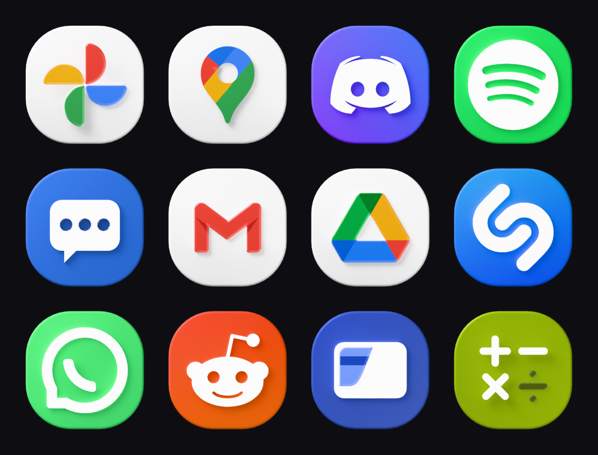
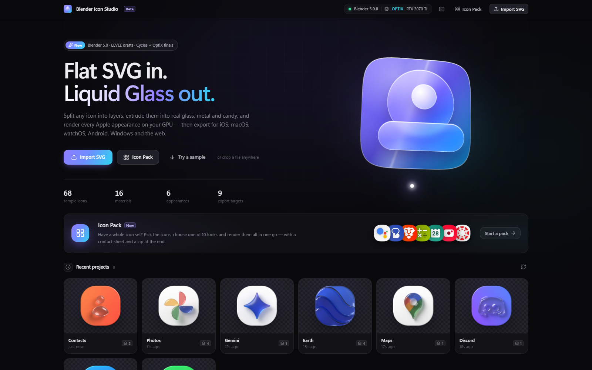
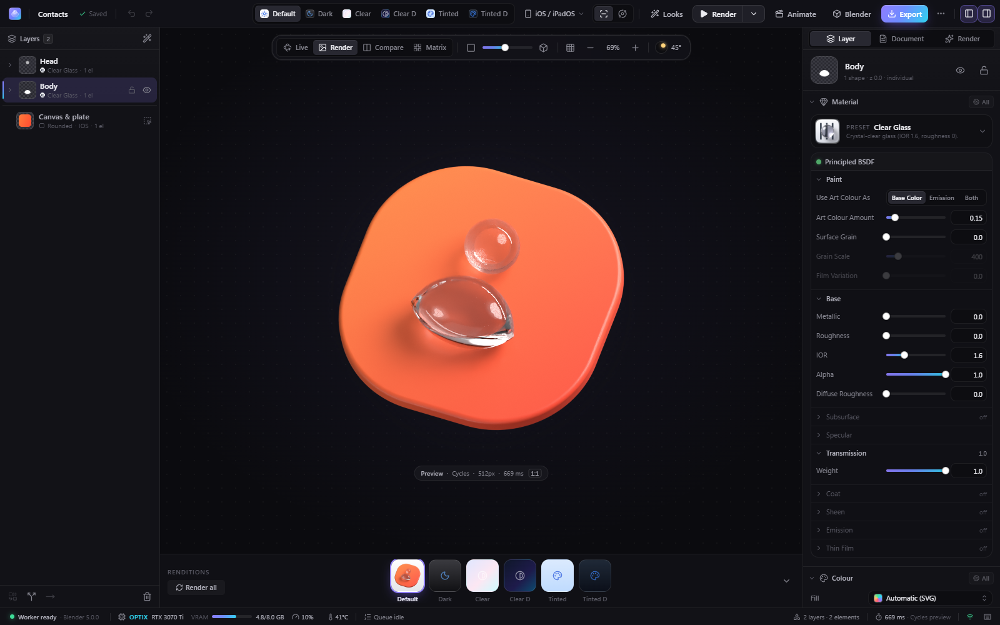
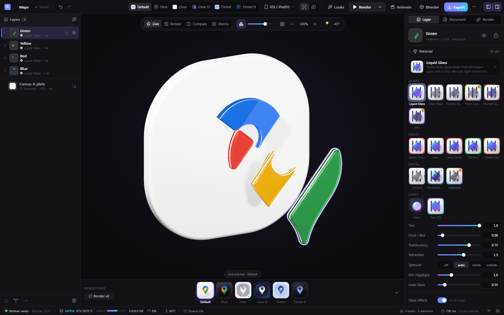
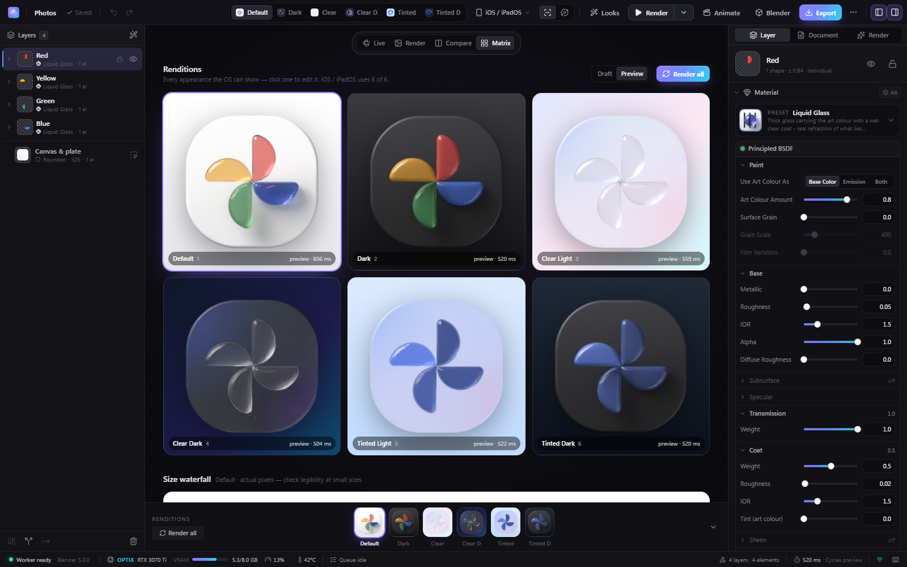
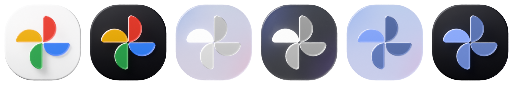
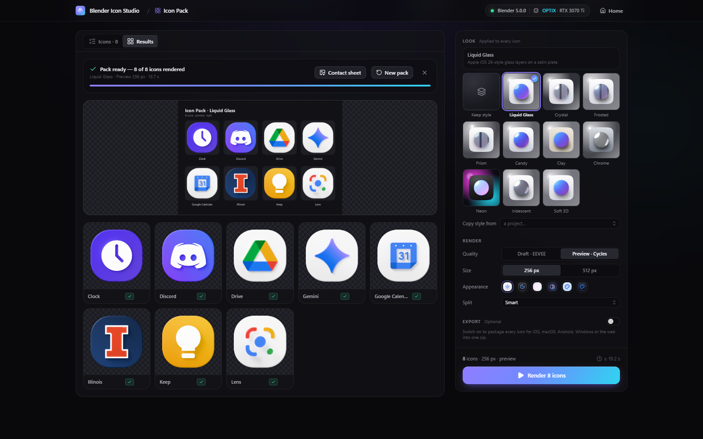
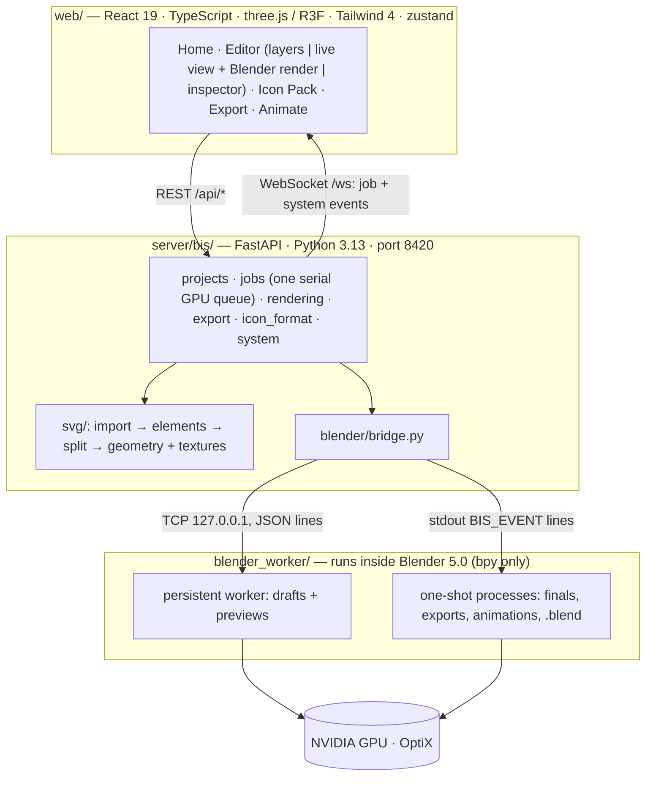

<div align="center">

# Blender Icon Studio

**Flat SVG in. Liquid Glass out.**<br>
Turn flat SVG app icons into layered, physically rendered 3D, glass and Liquid Glass icons — rendered by
Blender 5.0 on your own GPU, exported for every platform.



<sub>Twelve icons from the 68-icon sample corpus, imported as-is and rendered by Cycles + OptiX.</sub>

[Quick start](#quick-start) · [Tour](#a-tour-of-the-app) · [Features](#features) · [GPU notes](#gpu-and-optix-notes) ·
[Architecture](#architecture) · [Development & tests](#development-and-tests) · [Troubleshooting](#troubleshooting)

</div>

---

Blender Icon Studio works like Apple's Icon Composer, with Blender doing the rendering. Drop in an SVG and the
app splits it into depth layers. Each layer is extruded with real rounded bevels, so the pill edges bend light.
You pick materials, lighting and appearances; a three.js view updates instantly, EEVEE renders a draft in a
fraction of a second, and Cycles with OptiX renders the faithful glass. One click exports a ready-to-ship icon
set for iOS, macOS, watchOS, Android, Windows and the web.

## Quick start

**You need:** Windows 11 · an NVIDIA RTX GPU (OptiX) · **Blender 5.0** at
`C:\Program Files\Blender Foundation\Blender 5.0\blender.exe` (or set `BIS_BLENDER`) · **Python 3.13**
(the `py` launcher) · **Node.js 22+**.

1. Double-click **`Blender Icon Studio.cmd`**. On the first run it:
   - creates `.venv` and installs `requirements.txt`;
   - runs `npm install` and builds the web UI into `web/dist`;
   - starts the server on <http://127.0.0.1:8420>;
   - opens the app in an Edge app window (or your default browser if Edge is missing).
2. Pick a sample or drop an SVG anywhere on the home screen.
3. Edit layers, materials and lighting — the live view, the EEVEE draft and the Cycles preview follow.
4. Click **Export**, choose the targets and download the zip.

Close the launcher console to quit; the Blender processes are tied to the server and exit with it, even if the
server is killed. If the server is already running, the launcher just opens a new window.

| Launcher option (`.cmd` or `scripts\start.ps1`) | Effect |
|---|---|
| `-Port <n>` | serve on another port |
| `-NoBrowser` | do not open a window |
| `-Rebuild` / `-SkipBuild` | force / never rebuild the web UI |
| `-Fake` | run without Blender, with flat Pillow previews (UI work without a GPU) |
| `-NoWorker` | start the Blender worker on the first render instead of at startup |

## A tour of the app

### Home — import, samples and Icon Pack



Import an SVG (drag and drop works anywhere), open one of the 68 sample icons in `samle icons/` (plus the
pipeline test files) or start an **Icon Pack**. The status pill shows the Blender version and the OptiX GPU.

### The editor



- **Layers** on the left: drag to reorder, merge, split, move elements between layers, hide and lock. The
  *Canvas & plate* row holds the plate (the detected source plate becomes a parametric squircle, circle or
  rounded rectangle).
- **Stage** in the middle, with four views:
  - **Live** — an instant three.js preview that mirrors the Blender scene (materials, lighting, colour mode).
    Its backdrop repaints the stage pixel for pixel (under the Render view's faded checkerboard), so there is
    no box around it in any colour mode.
  - **Render** — the latest Blender render. *Fit* never enlarges a render past its own pixels (a 512 px preview
    is shown at 512 device pixels, centred, so on a 150 % display it is smaller than the Live frame); the chip
    under it says `1:1`, or the actual scale when you zoom; for a render larger than the stage the zoom menu
    adds *Actual pixels*.
  - **Compare** — drag a divider between the live view and the Blender render.
  - **Matrix** — all six appearances side by side plus a size waterfall (180 → 20 px).
- **Renditions strip** at the bottom: Default, Dark, Clear Light/Dark, Tinted Light/Dark — click to edit one.
- **Inspector** on the right: the material gallery (rendered swatches), preset parameters, depth / bevel / z,
  fill overrides with a gradient editor, shadow, opacity, blend mode and per-appearance overrides; the
  Document tab holds platform, plate, lighting, camera, colour mode and render settings.
- **Status bar**: worker state, OptiX GPU, VRAM, utilisation, the GPU queue and the last render time.

### Exploded layer stack



Press <kbd>X</kbd> (or drag the explode slider) to spread the layers in depth and swing the camera into a
three-quarter view — the same stack Blender renders, layer for layer.

### Six appearances



Icon Composer's six renditions — **Default**, **Dark**, **Clear Light**, **Clear Dark**, **Tinted Light** and
**Tinted Dark** — rendered in one go (<kbd>Shift</kbd>+<kbd>M</kbd>). Dark and mono variants can override fills,
opacity, blend mode and materials per layer.



### Icon Pack (batch)



Pick many icons, apply one look (or a style copied from another project) and render them all in one queued job,
with a contact sheet and — optionally — every platform export packed into one zip.

## Features

**Import and split**
- Any SVG: drag and drop or the sample library; plain, UTF-16 and gzip-compressed (`.svgz`) files.
  Gradients, opacity, strokes, clip paths and embedded raster images are handled; baked drop-shadow filters
  become layer shadows; off-canvas junk is culled.
- Smart layer split (smart, group, colour, per element or single), then merge / split / move. Z-order
  validation stops overlapping art from being "woven" through other layers.
- Full-bleed artwork (the art itself is the icon shape) is recognised and labelled *Full-bleed*.

**Real 3D**
- Every layer is a bezier curve extruded to its thickness and round-bevelled; the bevel is clamped to the
  thinnest feature, so thin strokes never invert. Depth per layer, and an explode control for hero shots.

**Materials and light**
- **16 material presets** (`shared/presets.json`): Liquid Glass, Clear, Frosted and Stained Glass, Prism
  Crystal, Jelly, Glossy Plastic, Satin, Hard Candy, Gummy, Chrome, Anodized Metal, Matte Clay, Iridescent,
  Neon (with bloom) and Flat 2D.
- **Lighting rigs**: an angle + elevation dial with Icon Composer's −45° default; presets Studio, Soft,
  Dramatic, Top Light, Dark Field, Golden, Neon Night and Flat.
- **Colour modes**: Neutral (Khronos PBR Neutral, brand-accurate — the default), Standard (SVG-exact),
  Photographic and Punchy (AgX). The live view applies the same view transform.

**Looks and styles**
- **Looks** restyle the whole icon in one click — Liquid Glass, Crystal, Frosted, Prism, Candy, Clay, Chrome,
  Neon, Iridescent and Soft 3D. A look sets every layer's material, depth, bevel and shadow, restacks the
  layers (`z = i × zGap`) and sets the plate material plus, when it defines them, lighting, camera, colour mode
  and tint. Bevels stay clamped to 0.9 × each layer's safe radius. The icon's own plate colour and shape are
  kept unless the look sets them (Neon switches the plate to System Dark).
- **Copy / paste style** between icons (<kbd>Ctrl</kbd>+<kbd>Alt</kbd>+<kbd>C</kbd> / <kbd>V</kbd>): the dominant
  layer material, depth and shadow, each layer's material by stack position, the median layer gap, the plate
  material, lighting, camera, colour mode and tint. A plate *fill* only travels when it's a deliberate System
  Light / System Dark / None fill (`?plateFill=true&shape=true` copies fill and shape anyway).

**Rendering** — all Cycles work runs on the OptiX device:

| Path | Engine | Typical time (RTX 3070 Ti) | Used for |
|---|---|---|---|
| Live | three.js (WebGL) | every frame | layout, materials, lighting while you drag |
| Draft | EEVEE, 512 px | ~0.3 s warm | automatic after each edit |
| Preview | Cycles + OptiX denoiser, 512 px, 48 spp | ~0.6–1 s | automatic ~1.2 s after edits settle |
| Final / Ultra | Cycles, 1024 / 2048 px | seconds | exports and hero shots (one-shot process) |

**Export** (one zip):

| Target | What you get |
|---|---|
| iOS / iPadOS | `AppIcon.appiconset`: 1024 universal + dark + tinted luminosity variants and `Contents.json` |
| macOS | `AppIcon.icns`, `AppIcon.iconset` and `AppIcon.appiconset`, with the Tahoe 824/1024 body and transparent margins |
| watchOS | 1024 appiconset + a 1088 circle |
| Android | adaptive icon (foreground layers / background plate / themed monochrome, 108 dp, all densities), legacy square + round mipmaps, the XML, and a 512 Play Store icon |
| Windows | multi-size `app.ico` (16–256) + PNGs |
| Web / PWA | `favicon.ico` (16/32/48), `favicon.svg`, `apple-touch-icon`, 192/512 + maskable icons, `manifest.webmanifest` and a `<head>` snippet |
| Marketing | perspective hero render + exploded hero (transparent PNG) |
| Icon Composer | `.icon` bundle (beta): layer SVGs + `icon.json`, groups ordered front→back, dark/tinted specializations |
| Blender | the `.blend` scene with packed textures |

**Also:** animations (turntable, tilt, float, light sweep, explode) as MP4 (H.264), WebP, GIF or a PNG
sequence · **Icon Pack** batches with progress ("Icon 7/24: Maps"), per-icon failure marking, cancel that
keeps finished icons, and live drafts that keep running between icons · **Open in Blender** saves the scene and
opens it in your Blender GUI (started through WMI on Windows, so it stays open after the server stops).

<details>
<summary><b>Keyboard shortcuts</b></summary>

| Keys | Action |
|---|---|
| <kbd>1</kbd> – <kbd>6</kbd> | switch appearance (Default, Dark, Clear Light, Clear Dark, Tinted Light, Tinted Dark) |
| <kbd>V</kbd> | cycle the stage: Live → Render → Compare → Matrix |
| <kbd>O</kbd> | front / orbit view |
| <kbd>X</kbd> / <kbd>G</kbd> | explode the stack / icon grid overlay |
| <kbd>Ctrl</kbd>+<kbd>0</kbd>, <kbd>Ctrl</kbd>+wheel | zoom to fit / zoom the stage |
| <kbd>R</kbd> / <kbd>Shift</kbd>+<kbd>R</kbd> | Cycles preview / Final render |
| <kbd>Shift</kbd>+<kbd>M</kbd> | render all six renditions |
| <kbd>Ctrl</kbd>+<kbd>Z</kbd> / <kbd>Ctrl</kbd>+<kbd>Shift</kbd>+<kbd>Z</kbd> | undo / redo |
| <kbd>Ctrl</kbd>+<kbd>G</kbd> · <kbd>H</kbd> · <kbd>Del</kbd> | merge · hide · delete selected layers |
| <kbd>E</kbd> · <kbd>?</kbd> | export · all shortcuts |

</details>

## GPU and OptiX notes

- Cycles always uses the **OptiX** device: the CUDA and CPU device entries are disabled and the **OptiX
  denoiser** is used in every Cycles tier. EEVEE drafts run on the same GPU.
- The GPU is shared with the desktop (an 8 GB card already carries 3.5–4.7 GB from Windows and apps). To stay
  within that:
  - interactive tiers are clamped to **512 px**, and `use_persistent_data` is off;
  - Final (1024 px) and Ultra (2048 px) renders, exports and animations run in **one-shot Blender processes**
    that release their VRAM on exit (cancel = kill);
  - caustics stay off unless explicitly requested.
- The first EEVEE render after a driver or Blender update compiles shaders (about 12 s). The worker warms up
  at startup, and the status bar shows *Worker starting…* until it is ready.
- Exports at Final quality render up to 13 master images, one Blender process each (about 2–3 s of start-up per
  image on top of the render). Keep Ultra for hero shots.

## Architecture



- **Projects** live in `workspace/projects/<id>/`: `project.json`, the original and normalised SVG, `cache/`
  (geometry bundles, layer textures and layer SVGs), `renders/<jobId>.png`, `exports/<jobId>.zip` and `blend/`.
  Everything under a project is served at `/files/projects/<id>/…`.
- **Jobs:** one global GPU queue. Live drafts jump ahead and are *coalesced* (a newer live render replaces a
  queued one). A long export pauses between master renders to let live drafts and previews through, so the
  editor stays live. Cancel drops a queued job and kills a running one-shot process; a running draft in the
  persistent worker is marked cancelled at once and its result discarded. Progress streams over `/ws`.
- **Process model (decision D8):** drafts and previews use the warm persistent worker (~0.26 s for a warm
  128 px draft); everything heavy runs in a short-lived Blender process.
- **Data contract:** `server/bis/models.py` ⇄ `web/src/types.ts` (camelCase JSON) and `shared/presets.json`.
- The full plan is in [`docs/PLAN.md`](docs/PLAN.md); the research is in [`docs/research/`](docs/research/).

<details>
<summary><b>REST API</b> (prefix <code>/api</code>)</summary>

| Endpoint | Purpose |
|---|---|
| `GET /system`, `GET /system/logs` | status (Blender, worker, GPU, queue) and the tail of the worker's stdout |
| `POST /system/worker/restart` | restart the worker |
| `GET /presets` | material, lighting, platform, quality presets and `looks`, plus swatch URLs |
| `GET /looks` | the named looks `{id: {label, description, style}}` |
| `GET /samples` | the sample library |
| `GET /samples/{name}/thumbnail.png`, `GET /samples/{name}/source.svg` | a sample's thumbnail or raw SVG |
| `GET\|POST /projects` | list projects, or create one (multipart `file`, or JSON `{sample}`) |
| `GET\|PUT\|DELETE /projects/{id}` | read, replace or delete a project |
| `POST /projects/{id}/duplicate` | duplicate a project |
| `GET /projects/{id}/source.svg` | the project's original SVG |
| `POST /projects/{id}/split` | re-split the layers |
| `POST /projects/{id}/layers/merge` | merge layers |
| `POST /projects/{id}/layers/{layerId}/split` | split one layer |
| `POST /projects/{id}/elements/move` | move elements to another layer |
| `GET /projects/{id}/geometry` | the geometry bundle |
| `GET /projects/{id}/style` | copy style → `StyleSpec` (`?plateFill=true&shape=true` also copies the plate fill / shape) |
| `POST /projects/{id}/style` | paste style: exactly one of `{look}`, `{style: StyleSpec}` or `{fromProject}` → the saved `Project` (400 if not exactly one, 404 for an unknown look or project) |
| `GET /projects/{id}/layers/{layerId}/thumbnail.png` | a layer thumbnail |
| `POST /projects/{id}/render` | queue a render → `Job` |
| `POST /projects/{id}/renditions` | the six appearances → `Job[]` |
| `POST /projects/{id}/animate` | queue an animation → `Job` |
| `POST /projects/{id}/export` | queue an export → `Job`; the result holds `zip`, `files` and `previews` |
| `POST /projects/{id}/blend` | save a `.blend` (`{open: true}` launches Blender) → `Job` |
| `POST /batch` | Icon Pack: `BatchRequest` `{sources: [{sample} \| {projectId}], look? \| style? \| fromProject?, strategy, quality, size, appearance, export?}` → `Job` (kind `batch`); the result holds `items` (`BatchItemResult[]`), `contactSheet` and, with `export`, `zip` (files under `/files/batches/<jobId>/`); while it runs (and after a cancel) `result` is partial: `{items, count, failed, partial: true}` |
| `GET /jobs`, `GET /jobs/{id}`, `DELETE /jobs/{id}` | list, read or cancel jobs |
| `WS /ws` | `{type:'job', job}`, `{type:'system', status}` (every 2 s) and `{type:'project', projectId, event}` |

</details>

## Development and tests

```powershell
scripts\dev.ps1                 # API with --reload (new window) + Vite dev server with HMR on :5173
scripts\dev.ps1 -Fake           # the same without Blender (flat Pillow previews)
.venv\Scripts\python.exe -m uvicorn bis.main:app --app-dir server --port 8420   # server only
```

**Run every check with one command:**

```powershell
scripts\test.ps1                # pytest (Blender-free) + node viewport/UI tests + tsc + vite build
scripts\test.ps1 -Blender       # + the real Blender 5.0 suites (OptiX; small draft/preview renders)
scripts\test.ps1 -Only node,tsc # just some steps (pytest, blender, node, tsc, vite)
```

Or step by step:

```powershell
.venv\Scripts\python.exe -m pytest -q tests --ignore=tests/blender       # SVG pipeline, API (fake bridge), exports, styles, batch
.venv\Scripts\python.exe -m pytest -q tests/blender                      # real Blender 5.0 worker
$env:BIS_REAL_BLENDER = '1'; .venv\Scripts\python.exe -m pytest -q tests/test_api_integration.py tests/test_batch.py   # import → draft → export, Icon Pack
node --test web/src/viewport/tests/*.test.mjs                            # three.js viewport ⇄ worker parity, UI polish
cd web; npx tsc -b --noEmit; npx vite build                              # type check + production build
```

| Suite | What it covers |
|---|---|
| `tests/test_svg_*.py` | the SVG pipeline over the 68-icon corpus: import, split, geometry, units, ops |
| `tests/test_api.py` | REST, WebSocket, the job queue, coalescing, cancel and auto preview, with a FakeBridge |
| `tests/test_api_bridge.py` | the real `BlenderBridge` against a stand-in process: handshake, progress, restart, one-shot kill |
| `tests/test_export.py`, `test_style.py`, `test_batch.py` | every export target and the `.icon` writer · looks and style transfer · Icon Pack |
| `tests/test_api_integration.py` | the real SVG pipeline, plus opt-in real Blender runs (`BIS_REAL_BLENDER=1`) |
| `tests/blender/` | the worker inside Blender 5.0: every preset in draft + preview, framing, fills, quality (≤ 256 px) |
| `web/src/viewport/tests/` | constants the live view mirrors from `blender_worker/`, geometry edge cases, and the UI polish checks (stage backdrop, 1:1 renders, names, counts) |

| Environment variable | Meaning |
|---|---|
| `BIS_BLENDER` | path to `blender.exe` (default: Blender 5.0 under Program Files) |
| `BIS_PORT` | server port (default 8420) |
| `BIS_WORKSPACE` | data directory (default `<repo>/workspace`) |
| `BIS_NO_WORKER=1` | don't start the persistent worker at startup |
| `BIS_FAKE_BLENDER=1` | use the FakeBridge (no Blender, no GPU) |
| `BIS_EXPORT_MAX_SIZE` | cap export master renders (px), for debugging |

## Troubleshooting

| Symptom | Fix |
|---|---|
| Status bar says **Blender 5.0 not found** | Install Blender 5.0, or set `BIS_BLENDER` to `blender.exe`, then restart. |
| Worker state **error** / renders fail | The status bar shows the last Blender message. Full output: `GET /api/system/logs` or `workspace/logs/blender.log`. Click the worker state → *Restart worker*. |
| First render is slow | NVIDIA shader-cache compile after a driver update (one time). |
| Out of VRAM (OptiX error) | Close other GPU-heavy apps, lower the size or tier, or render Ultra only when needed. |
| "Web UI not built" page | Run `Blender Icon Studio.cmd -Rebuild`, or `cd web; npm run build`. |
| Port 8420 is busy | `Blender Icon Studio.cmd -Port 8430` |
| Export fails with "path is too long for Windows" | Move the repo (or just the data: set `BIS_WORKSPACE`) to a shorter folder, or enable Win32 long paths (`LongPathsEnabled`). |
| Edge doesn't open | The launcher falls back to the default browser; you can also open <http://127.0.0.1:8420> yourself. |
| `.icon` won't open in Icon Composer | The format is community-documented, so the export is **beta**. Import the layer SVGs from `Assets/` manually. |

Server log: `workspace/logs/server.log` · Blender output: `workspace/logs/blender.log`.
