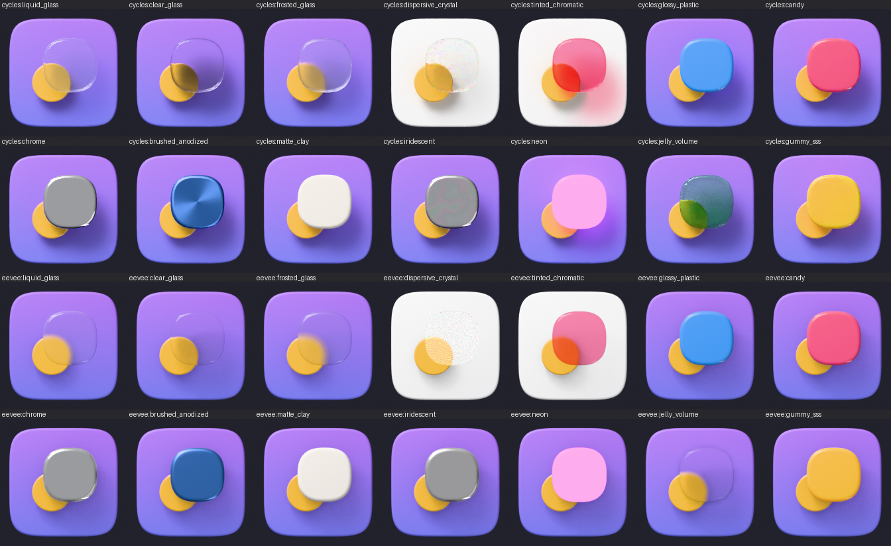
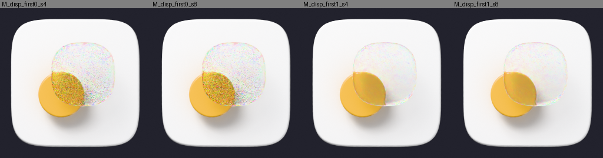
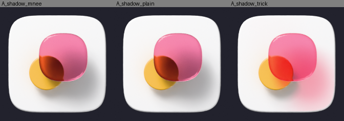
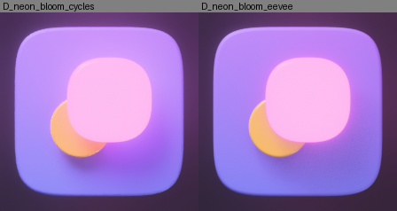
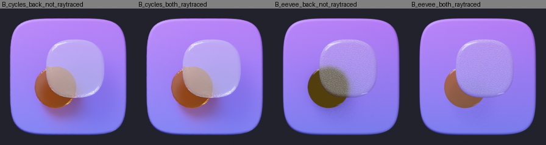
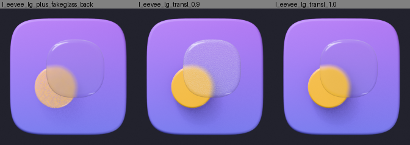
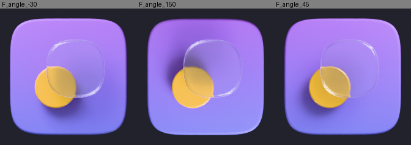
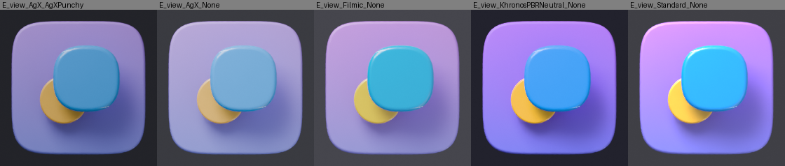
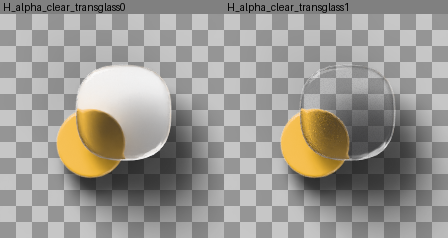

# Glass, Liquid Glass and premium icon materials in Blender 5.0

> **Critic note (2026-10-03):** see [`critic-review.md`](critic-review.md). Four things here are overruled:
> - `use_persistent_data` stays **off**;
> - finals use the **OptiX denoiser** (OIDN-GPU peaks +2.96 GB at 2048 px);
> - the XZ / −Y scene frame must be ported to PLAN's XY / +Z frame;
> - the pill bevel must be **clamped per layer** to the thinnest feature, because it inverts geometry on about half the real icons.

Research for **Blender Icon Studio**: physically recreating Apple-style Liquid Glass and other premium 3D icon materials with Cycles and EEVEE, plus the lighting rig and render settings to use.

- Target: Blender **5.0.0** (hash `a37564c4df7a`), Windows 11, RTX 3070 Ti (8 GB VRAM, about 3.3 GB already used by the desktop).
- Date: 2026-10-03.
- How the claims were checked. Each claim carries one of these tags:
  - **[I]**: checked by introspection in Blender 5.0.0 headless (`blender -b --factory-startup --python`): node type ids, socket names, enum values and RNA property names.
  - **[V]**: checked with a test render. All 14 material recipes below were built by script and rendered in **Cycles (OptiX GPU, 32 spp, OptiX/OIDN denoise, 192–256 px)** and **EEVEE (16–64 samples)**.
  - **[D]**: taken from the Blender 5.0 manual or release notes.
  - **[E]**: my own estimate or inference, not measured.
- Test harness used for the renders (throwaway): `%TEMP%/claude/.../scratchpad/glass/iconlab.py`. The verified code is reproduced in §9.
- Figures are in `docs/research/img/glass-materials/`.



---

## 0. TL;DR: decisions for the app

1. **Geometry makes the Liquid Glass look; the shader only finishes it.** Lensing at the edges comes from a **pill-shaped (fully rounded) edge profile**: bevel radius about ½ of the layer thickness, shaded smooth. Build each SVG layer as a 2D curve with `extrude` + `bevel_mode='ROUND'` + `bevel_depth`, and set `offset = -bevel_depth` so the silhouette still matches the SVG. [V]
2. **Liquid Glass shader** = `ShaderNodeBsdfPrincipled` with `Transmission Weight` 1, `Roughness` 0.0–0.35 ("frost"), `IOR` 1.45, `Coat Weight` 1 with `Coat Roughness` 0.02 (the crisp wet highlight), and `Specular IOR Level` 0.6.
   - Add an optional **light-angle-locked rim emission** (Geometry Normal · light direction × Layer Weight Fresnel → `Emission Strength`).
   - Wrap it in the **Light Path "Is Shadow Ray" → Transparent BSDF** trick, which gives soft neutral or chromatic shadows. [V, both engines]
3. **Chromatic shadows:** use the Is-Shadow-Ray trick with a tinted Transparent BSDF.
   - Cycles: true coloured shadows. [V]
   - EEVEE: shadows only get *lighter*. They stay grey, because EEVEE shadows are monochrome. [V]
   - MNEE shadow caustics work, but they are subtle with big soft lights. They only showed light through the glass when *Caustics ▸ Refractive* was enabled, and the **first use cost ~164 s of OptiX kernel compilation**. Keep MNEE as an opt-in "physical" mode. [V]
4. **Blender 5.0 has no native dispersion.** Neither Principled nor Glass BSDF has a `Dispersion` socket. [I] Native `Abbe Number` / `Dispersion Scale` inputs land in **5.3** (Cycles).
   - For 5.0, use **three R/G/B Glass lobes with offset IORs, applied only on the first transmission event** (`Light Path ▸ Transmission Depth > 0.5` → plain glass). This is Cycles only. [V]
   - The naive 3-lobe add-shader version goes black and noisy because the lobe colours multiply at the exit interface. [V]
5. **EEVEE glass checklist.** Set `scene.eevee.use_raytracing=True`. On the material set:
   - `surface_render_method='DITHERED'`
   - `use_raytrace_refraction=True` ("Raytraced Transmission")
   - `thickness_mode='SLAB'`
   - wire the Material Output `Thickness` socket to the layer depth.
   - Raise `ray_tracing_options.trace_max_roughness` to at least the frost roughness, otherwise frosted glass shows the world instead of the layers behind it.
   - **Only one raytraced-refraction layer can be seen through another**, so glass-on-glass breaks. [V] Keep `Transmission Weight` at 1.0; values below 1 render grainy. [V]
6. **Thin film (iridescence), anisotropy (brushed metal), volumes inside glass (jelly) and dispersion are Cycles-only.** EEVEE uses simplified fallbacks. [V/D]
7. **Lighting:** a procedural **studio world built from nodes**: a vertical gradient, a "softbox" blob in the key direction and a front fill, with the gradient rotated by the light angle and a flat backdrop for camera rays.
   - Add 4 area lights: Key disk, top Rim strip, opposite Rim strip and Fill.
   - All of it rotates with one **light angle** parameter. No HDRI files are needed. [V]
8. **Colour management:** default to **Khronos PBR Neutral**, which keeps brand colours. AgX washes saturated blues to pastel, Filmic shifts blue to cyan, and Standard clips and hue-skews highlights. [V]
9. **Output:** `film_transparent=True`, PNG RGBA 16-bit.
   - Set `cycles.film_transparent_glass=True` when glass should show what is behind it (for example a wallpaper) via alpha. [V]
   - Use `object.is_shadow_catcher=True` for floating marketing shots. Shadows land in alpha. [V]
   - EEVEE has no shadow catcher. [D]
10. **Performance (measured):**
    - Cycles OptiX at 192–256 px / 32 spp: **about 0.35–0.65 s per frame**, including scene sync.
    - EEVEE at 256 px: **0.1 s (16 spp, warm) / 0.26 s (64 spp)**, plus a 0.5–1.5 s shader compile the first time.
    - Peak GPU memory for the whole Blender process was about 1.5 GB. [V]

---

## 1. Liquid Glass broken into physical components

Apple describes Liquid Glass as a material that bends and concentrates light in real time ("lensing"). Its specular highlights respond to geometry and to device motion. It adapts tint and shadow opacity to the background, and it "illuminates from within" on interaction. Icon Composer exposes, per group: Liquid Glass on/off, **specular**, **blur**, **translucency**, **shadow (neutral or chromatic) with amount**, opacity, fill and blend mode. Icons can have up to 4 groups, stacked in Z order. ([WWDC25 219](https://developer.apple.com/videos/play/wwdc2025/219/), [WWDC25 361](https://developer.apple.com/videos/play/wwdc2025/361/), [createwithswift](https://www.createwithswift.com/crafting-liquid-glass-app-icons-with-icon-composer/))

| Visual component | What it is physically | Blender mapping (Cycles) | EEVEE notes |
|---|---|---|---|
| **Specular rim highlights** (bright arc on the lit edge, fainter on the opposite inner edge) | Fresnel reflection of bright sources on the rounded edge; the opposite arc is light refracted through the body and reflected off the far inner wall | Pill-profile bevel geometry. Coat layer (`Coat Weight` 1, `Coat Roughness` ≈0.02). **Rim strip lights at grazing angles** plus a softbox in the world. Optional art-directed boost: emission = `Fresnel × max(N·L,0)^3 + 0.45·max(−N·L,0)^3` | Same nodes work. Area lights give shaped specular highlights (LTC). [V] |
| **Refraction / lensing near edges** | Snell refraction through a thick body whose surface curves at the rim | `Transmission Weight` 1, `IOR` 1.4–1.6, rounded bevel. More bevel radius or more IOR gives stronger lensing | Needs Raytraced Transmission plus scene raytracing. Only content in the depth buffer is refracted (screen-trace). Off-screen content falls back to probes. [D] |
| **Frosted blur** (Icon Composer "blur") | Microfacet roughness of the transmissive interface | Principled `Roughness` 0.05–0.35 on the transmission. Optional micro bump (Noise, Scale ≈400 → Bump strength 0.05–0.1) for a sandblasted look | Set `trace_max_roughness` ≥ roughness (we use 0.8). Otherwise rough transmission falls back to probe/world and the layers behind disappear. [D/V] |
| **Translucency** (how much shows through) | Mix of clear transmission vs milky scattering or opaque base | Cycles: `Transmission Weight` 1 → 0.6 for milky. Or keep 1 and lighten `Base Color` / raise roughness | **Keep `Transmission Weight`=1.** Values below 1 mix Diffuse + Refraction, which EEVEE renders as visible grain. [V, see figure] Use roughness and `Base Color` instead. |
| **Tint / fill** | Absorption | `Base Color` tints transmission at every interface (squared through a slab). `ShaderNodeVolumeAbsorption` gives Beer–Lambert, depth-dependent tint | Volumes are not visible through refraction in EEVEE. [D/V] Use `Base Color` only. |
| **Shadows – neutral / chromatic** | Light attenuated (and coloured) by the glass; physically, focused caustics | Is-Shadow-Ray → Transparent BSDF (`Color` = grey for neutral, tint for chromatic). See §5 | Light Path "Is Shadow" is supported, but shadows are greyscale only. [V] |
| **Inner glow / illumination from within** | Light scattered inside the body | Emission driven by `1 − LayerWeight.Facing` (edge glow inside), or a low-density `ShaderNodeVolumeScatter` (Cycles) | Emission works. Volume does not (it is not seen through refraction). |
| **Chromatic dispersion at edges** | Wavelength-dependent IOR | 3-lobe first-hit trick (§3.4). Or post: compositor `CompositorNodeLensdist` `Dispersion` input (whole frame) | Not possible in-shader. The 3-lobe material renders as white noise. [V] |
| **Light responding to motion** | Moving light sources | Animate the single "light angle" parameter of the rig (§6) | Same |
| **Depth / layer separation** | Parallax plus contact shadows between layers | Real Z gaps between layers (0.1–0.3 × layer thickness), soft area-light shadows | Same (soft shadows via shadow-map raytracing) |

---

## 2. Geometry rules (they matter as much as the shader)

1. **Pill edge = lens.** Set `bevel_depth ≈ 0.4–0.5 × thickness` with `bevel_resolution` 6–8 and smooth shading. A sharp extrusion refracts like a window pane, with no lensing and no rim. [V]
2. **SVG layer → curve** (verified API, Blender 5.0) [I/V]:
   ```python
   cu = bpy.data.curves.new(name, 'CURVE')
   cu.dimensions = '2D'; cu.fill_mode = 'BOTH'          # 2D enum: BOTH/FRONT/BACK/NONE (3D curves: FULL/BACK/FRONT/HALF)
   sp = cu.splines.new('POLY'); sp.points.add(n-1); ...  # or BEZIER from the SVG path
   sp.use_cyclic_u = True; sp.use_smooth = True
   cu.extrude = max(depth/2 - bevel, 0.0)
   cu.bevel_mode = 'ROUND'; cu.bevel_depth = bevel; cu.bevel_resolution = 6
   cu.offset = -bevel          # keep the outer silhouette equal to the SVG outline
   ob.rotation_euler = (radians(90), 0, 0)   # curve XY -> world XZ, facing the -Y camera
   ```
   Do **not** leave `offset` at a non-zero default. Setting it to `1.0` grew every shape by 1 unit in the first test. [V]
3. **Scene convention:** the icon lies in the world **XZ plane facing −Y** (Blender Front view, so Z is "up" for the world gradient and sky). Layers stack toward the camera along −Y. The base plate front is at y≈0.
4. **Flat faces + orthographic camera reflect exactly one environment direction**, which gives a uniform colour. That is why chrome and iridescent faces look dead unless the world has a **front fill** term (§6). [V] A slight dome ("inflate" 2–5 % of the layer size, via Geometry Nodes or displacement) makes reflections sweep across the face. [E]
5. Feed EEVEE the real layer depth through `Material Output ▸ Thickness` (object-space). Use `thickness_mode='SLAB'` for flat layers and `'SPHERE'` for blobby ones. [D/I]

---

## 3. Material recipes (all identifiers verified in 5.0.0)

### 3.0 Exact Blender 5.0 identifiers you will need [I]

- **`ShaderNodeBsdfPrincipled`** inputs: `Base Color`, `Metallic`, `Roughness`, `IOR`, `Alpha`, `Normal`, `Diffuse Roughness`, `Subsurface Weight`, `Subsurface Radius`, `Subsurface Scale`, `Subsurface IOR`, `Subsurface Anisotropy`, `Specular IOR Level`, `Specular Tint`, `Anisotropic`, `Anisotropic Rotation`, `Tangent`, `Transmission Weight`, `Coat Weight`, `Coat Roughness`, `Coat IOR`, `Coat Tint`, `Coat Normal`, `Sheen Weight`, `Sheen Roughness`, `Sheen Tint`, `Emission Color`, `Emission Strength`, `Thin Film Thickness`, `Thin Film IOR`.
  - **There is no `Dispersion` and no `Transmission`.** The old name `Transmission` returns `None`.
  - Properties: `distribution` ∈ {`GGX`,`MULTI_GGX`}, `subsurface_method` ∈ {`BURLEY`,`RANDOM_WALK`,`RANDOM_WALK_SKIN`}.
- **`ShaderNodeBsdfGlass`**: `Color`, `Roughness`, `IOR`, `Normal`, `Thin Film Thickness`, `Thin Film IOR`. `distribution` ∈ {`BECKMANN`,`GGX`,`MULTI_GGX`}.
- **`ShaderNodeBsdfRefraction`**: `Color`, `Roughness`, `IOR` (default 1.45), `Normal`.
- **`ShaderNodeBsdfTransparent`**: `Color`.
- **`ShaderNodeBsdfMetallic`**: `Base Color`, `Edge Tint`, `IOR` (vector), `Extinction` (vector), `Roughness`, `Anisotropy`, `Rotation`, `Normal`, `Tangent`, `Thin Film Thickness`, `Thin Film IOR`. `fresnel_type` ∈ {`PHYSICAL_CONDUCTOR`,`F82`} (default `F82`).
- **`ShaderNodeLightPath`** outputs: `Is Camera Ray`, `Is Shadow Ray`, `Is Diffuse Ray`, `Is Glossy Ray`, `Is Singular Ray`, `Is Reflection Ray`, `Is Transmission Ray`, `Is Volume Scatter Ray`, `Ray Length`, `Ray Depth`, `Diffuse Depth`, `Glossy Depth`, `Transparent Depth`, `Transmission Depth`, `Portal Depth`.
- **`ShaderNodeMixShader`**: socket identifier `Fac` (displayed name "Factor"). `inputs["Fac"]` and `inputs["Factor"]` both resolve. Shaders are `inputs[1]` and `inputs[2]`.
- **`ShaderNodeMix`** (colour mix) has duplicate socket names. With `data_type='RGBA'` use `inputs[0]` (Factor), `inputs[6]` (A colour), `inputs[7]` (B colour) and `outputs[2]` (colour result).
- **`ShaderNodeLayerWeight`**: in `Blend`, out `Fresnel`, `Facing`. **`ShaderNodeFresnel`**: `IOR` → `Factor`. **`ShaderNodeNewGeometry`** outputs `Normal` (world space), `Incoming`, `Backfacing`, `Pointiness`, …
- **`ShaderNodeVolumeAbsorption`** (`Color`, `Density`). **`ShaderNodeVolumeScatter`** (`Color`, `Density`, `Anisotropy`; `phase` ∈ HENYEY_GREENSTEIN/FOURNIER_FORAND/DRAINE/RAYLEIGH/MIE). Also `ShaderNodeVolumePrincipled` and the new `ShaderNodeVolumeCoefficients`.
- **`ShaderNodeOutputMaterial`** inputs: `Surface`, `Volume`, `Displacement`, `Thickness`. `target` ∈ {`ALL`,`EEVEE`,`CYCLES`}. Use separate outputs per engine when fallbacks differ.
- **`ShaderNodeTangent`**: `direction_type` ∈ {`RADIAL`,`UV_MAP`}, `axis` ∈ {`X`,`Y`,`Z`}.
- Other nodes used: `ShaderNodeBump` (`Strength`, `Distance`, `Filter Width`, `Height`, `Normal`), `ShaderNodeTexNoise` (`Scale`, `Detail`, `Roughness`, `Lacunarity`, `Distortion`), `ShaderNodeMapRange` (`Value`, `From Min/Max`, `To Min/Max`; `interpolation_type`), `ShaderNodeValToRGB` (Color Ramp, input `Fac`), `ShaderNodeCombineXYZ` / `ShaderNodeSeparateXYZ`, `ShaderNodeVectorMath` (`DOT_PRODUCT`, `NORMALIZE`…), `ShaderNodeBevel` (Cycles only).
- `ShaderNodeBsdfSpecular` does not exist. The EEVEE-only specular node is `ShaderNodeEeveeSpecular`.
- **Material RNA:**
  - `surface_render_method` ∈ {`DITHERED`,`BLENDED`}
  - `use_raytrace_refraction` (UI "Raytraced Transmission"), `use_transparent_shadow`, `thickness_mode` ∈ {`SPHERE`,`SLAB`}, `use_thickness_from_shadow`, `use_transparency_overlap`, `use_backface_culling`, `use_backface_culling_shadow`, `volume_intersection_method` ∈ {`FAST`,`ACCURATE`}, `displacement_method`.
  - `material.use_nodes` still works but prints a DeprecationWarning (removal planned for 6.0).
- **Object RNA:** `is_shadow_catcher`, `is_holdout`, `visible_camera/diffuse/glossy/transmission/volume_scatter/shadow`, `cycles.is_caustics_caster`, `cycles.is_caustics_receiver`. **Light:** `light.cycles.is_caustics_light`. **World:** `world.cycles.is_caustics_light`.

### 3.1 Shared building blocks [V]

```python
def shadow_wrap(nt, out, surface_socket, shadow_rgb):
    """Shadow rays see a tinted Transparent BSDF: soft neutral or chromatic shadows, no caustic noise."""
    lp = nt.nodes.new("ShaderNodeLightPath")
    tr = nt.nodes.new("ShaderNodeBsdfTransparent"); tr.inputs["Color"].default_value = (*shadow_rgb, 1)
    mix = nt.nodes.new("ShaderNodeMixShader")
    nt.links.new(lp.outputs["Is Shadow Ray"], mix.inputs["Fac"])
    nt.links.new(surface_socket, mix.inputs[1]); nt.links.new(tr.outputs["BSDF"], mix.inputs[2])
    nt.links.new(mix.outputs["Shader"], out.inputs["Surface"])

def eevee_glass_settings(mat, slab=True):
    mat.surface_render_method = 'DITHERED'
    mat.use_raytrace_refraction = True        # "Raytraced Transmission"
    mat.thickness_mode = 'SLAB' if slab else 'SPHERE'
    mat.use_transparent_shadow = True         # needed for the Transparent-BSDF shadow branch

def thickness(nt, out, value):                # EEVEE only; object-space layer depth
    v = nt.nodes.new("ShaderNodeValue"); v.outputs[0].default_value = value
    nt.links.new(v.outputs[0], out.inputs["Thickness"])
```

Shadow colour conventions:
- neutral: `shadow_rgb = (1 - amount)` grey, with amount 0.15–0.4;
- chromatic: `shadow_rgb = tint ** k` with k between 0.5 (light) and 1.5 (deep);
- physical: no wrap (dark shadow, or MNEE).

### 3.2 Liquid Glass (Apple-like): both engines [V]

| Socket | Value | App parameter |
|---|---|---|
| `Base Color` | (0.96, 0.98, 1.0) | tint / fill |
| `Roughness` | 0.12 (range 0–0.35) | **blur / frost** |
| `IOR` | 1.45 (1.4–1.7) | **refraction strength** |
| `Transmission Weight` | 1.0 (Cycles may use 0.6–1.0) | **translucency** (EEVEE: keep at 1) |
| `Coat Weight` / `Coat Roughness` / `Coat IOR` | 1.0 / 0.02 / 1.5 | **specular** on/off |
| `Specular IOR Level` | 0.6 | specular amount |
| `Emission Color` / `Emission Strength` | white / rim mask × 3.0 | **specular rim** amount |
| Shadow wrap | grey (0.75, 0.78, 0.82) or tint | **shadow neutral/chromatic + amount** |
| `Thickness` output | layer depth (0.12 in tests) | — |

Rim mask, all world-space and engine-agnostic. `L` = the light-angle direction from §6:

```
dot   = VectorMath(DOT_PRODUCT, Geometry.Normal, CombineXYZ(L))
key   = Math(POWER, Math(MAXIMUM, dot, 0), 3)
back  = Math(MULTIPLY, Math(POWER, Math(MAXIMUM, Math(MULTIPLY, dot, -1), 0), 3), 0.45)
rim   = Math(MULTIPLY, Math(ADD, key, back), LayerWeight(Blend=0.25).Fresnel)
Principled.Emission Strength = rim * rim_strength
```
Then apply `shadow_wrap`, `thickness` and `eevee_glass_settings`.

Inner glow (optional): add `Math(SUBTRACT, 1, LayerWeight.Facing)` × glow into the same Emission Strength, and tint `Emission Color`. The sockets are verified; this variant was not render-tested separately.

### 3.3 Clear Glass [V]
- Principled: `Transmission Weight` 1, `Roughness` 0, `IOR` 1.5, `Base Color` white.
- Alternative: `ShaderNodeBsdfGlass` (`Color` white, `IOR` 1.5, `distribution='MULTI_GGX'`).
- Without the shadow wrap, Cycles and EEVEE both give a **dark shadow under clear glass** (visible in the sheet). Use `shadow_wrap(grey 0.85)` for believable light shadows.
- EEVEE: `eevee_glass_settings` + Thickness.

### 3.4 Frosted Glass [V]
- Principled: `Transmission Weight` 1, `Roughness` 0.35, `IOR` 1.5, `Base Color` (0.95, 0.97, 1).
- Glossy top: `Coat Weight` 1, `Coat Roughness` 0.03.
- Micro-structure: `TexCoord.Object → Noise(Scale 400, Detail 2).Factor → Bump(Strength 0.08, Distance 0.002).Normal → Principled.Normal`.
- Shadow wrap grey 0.6.
- EEVEE: `trace_max_roughness ≥ 0.5` (0.8 used) to keep refracting the layers behind. EEVEE renders a nice blurred refraction. [V]

### 3.5 Dispersive Crystal: Cycles only [V]
Blender 5.0 has no native dispersion. The 5.3 Principled BSDF adds `Abbe Number` + `Dispersion Scale` ([80.lv](https://80.lv/articles/principled-bsdf-in-blender-s-cycles-now-supports-dispersion); [PR #162041](https://projects.blender.org/blender/blender/pulls/162041)). For 5.0:

```
lobeR = Glass(Color=(1,0,0), IOR=base-s)      base=1.52, s=0.04 (subtle) … 0.08 (strong)
lobeG = Glass(Color=(0,1,0), IOR=base)
lobeB = Glass(Color=(0,0,1), IOR=base+s)
split = Add(Add(lobeR, lobeG), lobeB)          # R+G+B = white, so energy-conserving at one interface
plain = Glass(Color=white, IOR=base)
surf  = Mix(Fac = Math(GREATER_THAN, LightPath.Transmission Depth, 0.5), split, plain)
shadow_wrap(surf, grey 0.8)
```
- Why the first-hit gate matters: without it, a path that enters through the R lobe and exits through the G lobe gets (1,0,0)·(0,1,0)=0. The crystal goes dark, and the 32 spp result is heavy rainbow noise that the denoiser cannot remove. With the gate, the inside of the crystal is clean and only the edges show colour fringes. 
- Final renders still need **≥256 spp** for this preset [E].
- EEVEE: `Transmission Depth` is unsupported there, and 3 refraction closures render as white noise. [V] Use an EEVEE-only output with plain clear glass (`ShaderNodeOutputMaterial.target='EEVEE'`).

### 3.6 Tinted Glass with chromatic shadow [V]
- Principled: `Base Color` = tint (for example (1, 0.25, 0.45)), `Transmission Weight` 1, `Roughness` 0.04, `IOR` 1.5.
- `shadow_wrap(tint)`. Cycles gives a soft pink/red shadow on a white plate, and the light reaching layers underneath is tinted too.
- For depth-dependent tint (thicker = deeper), use a white Principled surface plus `ShaderNodeVolumeAbsorption(Color=tint, Density 2–10)` on `Volume`. This is Cycles only.
- EEVEE: the glass renders tinted, but the shadow is grey and dithered. See §5 for fakes.



### 3.7 Glossy Plastic / Candy [V]
- **Glossy plastic:** `Base Color` saturated, `Roughness` 0.35, `Coat Weight` 1, `Coat Roughness` 0.03. Both engines.
- **Candy (translucent hard candy):** `Base Color` (1, 0.1, 0.25), `Roughness` 0.15, `Subsurface Weight` 1, `Subsurface Radius` (1, 0.25, 0.3), `Subsurface Scale` 0.08 (scene units), `Coat Weight` 1 / `Coat Roughness` 0.02.
  - `subsurface_method='RANDOM_WALK'` (default) is Cycles only. EEVEE uses its own approximation, which looked nearly identical in the test.
  - A glassier candy: `Transmission Weight` 0.6–0.9 + Coat (Cycles).

### 3.8 Chrome / Polished Metal [V]
- Principled: `Metallic` 1, `Base Color` (0.92, 0.93, 0.95), `Roughness` 0.03–0.08.
- Physically exact alternative: `ShaderNodeBsdfMetallic` with `fresnel_type='PHYSICAL_CONDUCTOR'` and the `IOR`/`Extinction` vectors of the metal. Or use `F82` with `Base Color` + `Edge Tint`.
- **Chrome is the environment.** With the gradient-only world the face rendered almost black. Adding the front-fill and softbox terms (§6) fixed it. [V]

### 3.9 Brushed / Anodized Metal [V]
- Principled: `Metallic` 1, `Base Color` = anodize colour (0.15, 0.35, 0.9), `Roughness` 0.3.
- `Anisotropic` 0.8, `Anisotropic Rotation` 0, `Tangent ← ShaderNodeTangent(direction_type='RADIAL', axis='Z')`. Object-local Z is the layer normal, so this gives **circular/spun brushing**. Use `UV_MAP` for linear brushing.
- Streaks that also work in EEVEE: `TexCoord.Object → Mapping(Scale=(1,300,1)) → Noise(Scale 20, Detail 8) → Bump(Strength 0.15, Distance 0.001) → Normal`.
- Anisotropy is **Cycles only**. EEVEE gives plain blue metal with faint streaks. [D/V]
- Real anodizing is a thin oxide film. Optionally set `Thin Film Thickness` 250–450 nm and `Thin Film IOR` 2.0–2.4 for titanium-like interference colours (Cycles 5.0 supports thin film on metals). [D]

### 3.10 Matte Clay [V]
- Principled: `Base Color` (0.8, 0.76, 0.72), `Roughness` 0.9, `Specular IOR Level` 0.3, `Diffuse Roughness` 0.5.
- Oren-Nayar diffuse roughness is Cycles only; EEVEE is Lambertian. Optional `Sheen Weight` 0.1–0.2 for a soft-touch look; Sheen is a crude approximation in EEVEE.

### 3.11 Iridescent (thin film): Cycles only [V]
- Metal variant (oil on metal, anodized): `Metallic` 1, `Base Color` (0.9, 0.9, 0.92), `Roughness` 0.15, `Thin Film IOR` 1.6.
- `Thin Film Thickness ← MapRange(Noise(Object coords, Scale 3).Factor, 0..1 → 250..900 nm)` gives banded oil-slick colours.
- Dielectric variant (soap, coated glass): `Base Color` near-black or transmissive, `Metallic` 0, same film inputs.
- Rules [D]:
  - The effect is strongest at 100–1000 nm.
  - `Thin Film IOR` must differ from both 1.0 and the base `IOR`.
  - The `Thin Film` inputs also exist on `ShaderNodeBsdfGlass` and `ShaderNodeBsdfMetallic`.
- EEVEE ignores thin film entirely; it rendered plain grey metal. [V] Fallback idea [E]: `LayerWeight.Facing → ColorRamp(rainbow) → Specular Tint`/`Coat Tint`.
- In the test the iridescence was subtle. It needs a bright, varied environment to reflect.

### 3.12 Emissive Neon [V]
- Principled: `Base Color` (0.05, 0.05, 0.05), `Roughness` 0.2, `Emission Color` = neon colour, `Emission Strength` 3–5.
- Glow comes from the **compositor**. Blender 5.0 changed the API [I/V]:
  ```python
  ng = bpy.data.node_groups.new("IconComp", "CompositorNodeTree")
  ng.interface.new_socket(name="Image", in_out='OUTPUT', socket_type='NodeSocketColor')
  rl = ng.nodes.new("CompositorNodeRLayers"); gl = ng.nodes.new("CompositorNodeGlare")
  gl.inputs["Type"].default_value = 'Bloom'      # options are now input sockets (MENU): Type, Quality, Threshold, Strength, Size, ...
  gl.inputs["Quality"].default_value = 'High'; gl.inputs["Threshold"].default_value = 0.8
  gl.inputs["Strength"].default_value = 0.6;   gl.inputs["Size"].default_value = 0.6
  go = ng.nodes.new("NodeGroupOutput")
  ng.links.new(rl.outputs["Image"], gl.inputs["Image"]); ng.links.new(gl.outputs["Image"], go.inputs[0])
  scene.compositing_node_group = ng; scene.render.use_compositing = True
  ```
  - `CompositorNodeComposite` no longer exists, and `scene.node_tree` is replaced by `scene.compositing_node_group`.
  - Bloom worked identically in Cycles and EEVEE. EEVEE no longer has built-in bloom. [V]
  - `render.compositor_device` ∈ {`CPU`,`GPU`}.
- Under Khronos Neutral or AgX, high emission strengths desaturate toward white (strength 12 rendered almost white). [V] Keep the core around 3–5 and let the bloom carry the colour.
- 

### 3.13 Jelly / Gummy [V]
- **Jelly (Cycles):**
  - Surface: Principled with `Base Color` white, `Transmission Weight` 1, `Roughness` 0.08, `IOR` 1.35.
  - Volume: `Add(VolumeAbsorption(Color=tint, Density 8), VolumeScatter(Color=tint, Density 4, Anisotropy 0.3)) → Output.Volume`.
  - Needs `cycles.volume_bounces ≥ 1`; the default is **0**, and the tests used 2. 5.0 uses unbiased null-scattering volumes by default, with `cycles.volume_biased` to revert. [D/I]
  - In EEVEE it renders as plain clear glass, because volumes do not show through refraction. [V]
- **Gummy (both engines):** `Base Color` = tint, `Subsurface Weight` 1, `Subsurface Radius` = tint, `Subsurface Scale` 0.3, `Roughness` 0.2, `Coat Weight` 0.6 / `Coat Roughness` 0.05. Use it as the EEVEE fallback for jelly.

### 3.14 Engine support matrix

| Preset | Cycles | EEVEE | EEVEE fallback |
|---|---|---|---|
| Liquid Glass | full | good (refraction, rim, grey shadow) | lower glass groups → "fake glass" (§4) |
| Clear / Frosted Glass | full | good | — |
| Dispersive Crystal | 3-lobe first-hit | broken (white noise) | plain clear glass via `target='EEVEE'` output |
| Tinted + chromatic shadow | full | glass ok, shadow grey | shadow card / compositor tint (§5) |
| Glossy Plastic, Candy, Gummy, Matte Clay, Chrome | full | good | — |
| Brushed / Anodized | full | no anisotropy | bump streaks only |
| Iridescent | full | none | rainbow ramp hack [E] |
| Neon | + compositor bloom | + compositor bloom | — |
| Jelly (volume) | full | no volume through glass | Gummy SSS |

---

## 4. EEVEE glass: settings and hard limits

Scene settings, verified property names [I]:
```python
ee = scene.eevee
ee.use_raytracing = True
ee.ray_tracing_method = 'SCREEN'                       # {'PROBE','SCREEN'}
ee.ray_tracing_options.resolution_scale = '1'          # '1','2','4',... ('2' = half-res for drafts)
ee.ray_tracing_options.trace_max_roughness = 0.8       # UI "Fast GI ▸ Threshold"; 1.0 = raytrace everything
ee.ray_tracing_options.screen_trace_quality = 0.25     # "Precision"
ee.ray_tracing_options.screen_trace_thickness = 0.2
ee.ray_tracing_options.use_denoise = True              # + denoise_spatial / denoise_temporal / denoise_bilateral
ee.use_fast_gi = True; ee.fast_gi_method = 'GLOBAL_ILLUMINATION'
ee.use_shadows = True; ee.shadow_ray_count = 2; ee.shadow_step_count = 8
ee.taa_render_samples = 16 … 64
ee.use_overscan = True; ee.overscan_size = 3.0        # screen-space effects fade at frame borders otherwise
```

Hard limits (from the [5.0 manual](https://docs.blender.org/manual/en/5.0/render/eevee/limitations/limitations.html), confirmed in renders):
- **Only one refraction event is modelled.** The thickness workflow approximates the second one.
- **Only dithered materials *not* using Raytraced Transmission can be refracted.** In the test, an orange glass layer under a top glass layer **disappeared** where they overlapped. 
  - **Fix for drafts:** only the top-most glass group uses `use_raytrace_refraction=True`.
  - Lower glass groups use a *fake glass*: Principled `Alpha` 0.35–0.5 + `Coat Weight` 1, `surface_render_method='DITHERED'`, no transmission. It is visible through the top glass, but grainy at 32 spp, so use 64+.
- Blended materials are not in the depth buffer, so they cannot be refracted or ray-traced.
- Transmission falls back to light probes or the world when the ray leaves the screen or roughness exceeds `trace_max_roughness`.
- Volumes are only rendered for camera rays, so they are invisible through refraction. Thin film, anisotropy, Diffuse Roughness, Random-Walk SSS, Bevel node and Light Falloff node are unsupported.
- Light Path in EEVEE: `Is Camera Ray` and `Is Shadow Ray` are supported. Depth outputs are mostly 0, and `Transmission Depth` is not supported.
- Mixing Diffuse and Refraction (for example `Transmission Weight` < 1) is noisy. 
- No shadow catcher. Shadows are monochrome. No bloom; use the compositor Glare node.
- "Headless rendering is not supported on headless Windows systems". `blender -b` on this desktop with the GPU works fine. [V]

---

## 5. Shadows: neutral, chromatic, physical

| Mode | Cycles | EEVEE | Cost |
|---|---|---|---|
| **Physical-plain** (no trick) | Glass is opaque to shadow rays, so you get a dark shadow. Light reaches the floor only through slow, noisy indirect caustics, and only if `caustics_refractive=True`. | dark grey shadow | free |
| **Neutral** (Icon Composer "Neutral") | `shadow_wrap(grey = 1 - amount)` gives a soft grey shadow whose softness follows light size | works (lighter grey, dithered) | free |
| **Chromatic** (Icon Composer "Chromatic") | `shadow_wrap(tint)` gives a coloured shadow, and also tints whatever lies under the glass | **grey only** | free |
| **MNEE shadow caustics** | Set `light.cycles.is_caustics_light`, `caster.cycles.is_caustics_caster`, `receiver.cycles.is_caustics_receiver`. Light only passed through with `caustics_refractive=True` in our test. It is subtle with large soft area lights. | n/a | **one-time ~164 s OptiX kernel compile**, then ~0.6–0.8 s at 224 px |

MNEE limitations [D]:
- refractive caustics inside shadows only;
- caster needs smooth normals;
- ignores bump/normal maps and volumes;
- handles at most 6 caster surfaces;
- handles only one refractive BSDF per material;
- Filter Glossy is ignored.

EEVEE chromatic shadow fakes [E]:
1. **Shadow card:** a flattened copy of the layer outline, offset along the light direction onto the plate, with a radial alpha falloff (Blended material) and colour = tint. This is the 2D shadow approach Icon Composer itself appears to use.
2. **Compositor:** render a per-layer shadow mask (light-group or view-layer holdout) and multiply by the tint.

Option 1 is recommended for the Draft tier.

---

## 6. Lighting rig, world and background plate

### 6.1 Camera
- Use an orthographic camera for exports: `cam.type='ORTHO'`, `ortho_scale = icon_size × 1.15–1.2`. The margin leaves room for shadows and glow. Place it at (0, −10, 0) with rotation (90°, 0, 0), looking +Y.
- Optional "hero" perspective camera for marketing shots: 85–135 mm lens, 10–20° tilt. Perspective also makes flat reflective faces sweep. [E]

### 6.2 One "light angle" drives everything [V]
Direction from the icon toward a light, with `a` = light angle (0 = from top, positive = clockwise toward +X) and `e` = elevation from the view axis:
```python
def light_dir(a_deg, e_deg):
    a, e = radians(a_deg), radians(e_deg)
    return (Vector((0,-1,0))*cos(e) + Vector((sin(a),0,cos(a)))*sin(e)).normalized()
```

| Light | Type / shape | Direction | Distance | Size | Energy (W) |
|---|---|---|---|---|---|
| Key | AREA `DISK` | `light_dir(a, 50)` | 6 | 4.0 | K = 350 |
| Rim top (glass edge definition) | AREA `RECTANGLE` | `light_dir(a, 82)` (grazing) | 5 | 6.0 × 0.4 | 0.5 K |
| Rim opposite | AREA `RECTANGLE` | `light_dir(a+180, 82)` | 5 | 6.0 × 0.4 | 0.15 K |
| Fill | AREA `RECTANGLE` | `light_dir(a+160, 55)` | 6 | 5.0 | 0.15 K |

- Orientation: `obj.location = d*dist; obj.rotation_euler = (-d).to_track_quat('-Z','Y').to_euler()`.
- Light objects default to `visible_camera=False`, `visible_glossy=True`. [I]
- Narrow **strip lights at grazing angles** trace thin highlights along glass bevels. This is the product-photography technique; the world's dark lower half acts as the black "flags" that give glass a dark contour ("bright-field" vs "dark-field" lighting). ([nightjar](https://nightjar.so/blog/how-to-photograph-glossy-and-reflective-products-without-killing-reflections), [prophotostudio](https://www.prophotostudio.net/blog/learning-center/why-photographing-glass-is-so-hard/))
- EEVEE: area light `spread` is unsupported and lights cannot have node trees. [D]

The sweep below shows light angle −30°, 150° and 45°. Shadows, rims and the world rotate together. [V]



### 6.3 Procedural studio world (no files) [V]
```
dir      = TexCoord.Generated                       (world: view direction)
rot      = Mapping(VECTOR, Rotation=(0, -a, 0))(dir)    # NOTE the minus sign (verified)
grad     = ColorRamp( MapRange(SeparateXYZ(rot).Z, -1..1 -> 0..1) )
           stops: 0.00 (0.02,0.02,0.025) | 0.55 (0.18,0.18,0.20) | 0.80 (0.60,0.60,0.62) | 1.00 (1,1,1)
softbox  = MapRange(SMOOTHSTEP, dot(normalize(dir), light_dir(a,50)), 0.90..0.97 -> 0..6)
front    = MapRange(dot(normalize(dir), (0,-1,0)), 0..1 -> 0..0.5)    # keeps flat faces/chrome alive
color    = Mix(RGBA, ADD, Fac 1)(grad, softbox + front)
world    = Mix Shader(Fac = LightPath.Is Camera Ray,
                      Background(color, Strength 0.6),          # what everything else sees
                      Background((0.05,0.05,0.06), 1))          # flat backdrop the camera sees
```
- `Is Camera Ray` works in both engines.
- With `film_transparent=True` the backdrop is irrelevant, but **refracted rays still see the studio gradient**. Glass then looks milky-white over an alpha background unless *Transparent Glass* is on (§7.4). [V]
- Alternative outdoor look: `ShaderNodeTexSky` with `sky_type` ∈ {`SINGLE_SCATTERING`, **`MULTIPLE_SCATTERING`** (5.0 default), `PREETHAM`, `HOSEK_WILKIE`}. Drive `sun_rotation` / `sun_elevation` from the light angle. EEVEE ignores the sun disc. [I/D]

### 6.4 Background plate (squircle base)
- Superellipse outline (n≈5) → same curve pipeline, with a small bevel (2–4 % of size).
- Opaque Principled material: `Roughness` 0.4–0.5, colour gradient from `TexCoord.Generated → SeparateXYZ.Y → Mix(RGBA) inputs[6]/[7] → Base Color` (curve-local Y = world up). It receives layer shadows and acts as the "wallpaper" that glass refracts.
- For Apple delivery, also export **layers without plate/mask**. Icon Composer and the OS add their own squircle mask and glass treatment. [E]
- **Shadow catcher** (Cycles): put a large plane behind or under the icon with `obj.is_shadow_catcher = True`, and optionally `view_layer.cycles.use_pass_shadow_catcher = True` to capture all indirect light.
- EEVEE has no shadow catcher ([BA thread](https://blenderartists.org/t/shadow-catcher-in-eevee-next-blender-4-2/1548135)). Render marketing composites in Cycles.

---

## 7. Render settings for an 8 GB RTX 3070 Ti

### 7.1 GPU setup [I/V]
```python
prefs = bpy.context.preferences.addons['cycles'].preferences
prefs.compute_device_type = 'OPTIX'
prefs.refresh_devices()
for d in prefs.devices:            # list contains: OPTIX 3070 Ti, CUDA 3070 Ti (also use=True!), CPU
    d.use = (d.type == 'OPTIX')
scene.cycles.device = 'GPU'
scene.render.use_persistent_data = True   # keep BVH/kernels between renders in the persistent worker
```
- The engine identifiers are `'CYCLES'`, `'BLENDER_EEVEE'` (renamed from `BLENDER_EEVEE_NEXT`) and `'BLENDER_WORKBENCH'`. [I/D]
- First-use costs:
  - OptiX kernels for new feature sets compile once and are then cached; MNEE took 164 s.
  - EEVEE compiles shaders per material: about 0.5–1.5 s cold, near zero warm.
  - **Warm both up at worker start.** [V]

### 7.2 Quality tiers

| Setting | **Draft** (EEVEE) | **Preview** (Cycles) | **Final** (Cycles) |
|---|---|---|---|
| Engine | `BLENDER_EEVEE` | `CYCLES`, GPU OptiX | `CYCLES`, GPU OptiX |
| Resolution | 256–512 | 256–512 | 1024 (master); 2048 hero |
| Samples | `taa_render_samples` 16 (drafts), 64 (clean) | `samples` 32–64, `use_adaptive_sampling` True, `adaptive_threshold` 0.05 | `samples` 1024 (cap), `adaptive_threshold` 0.005–0.01, `adaptive_min_samples` 64; dispersion preset ≥ 256 effective |
| Denoise | built-in RT denoise | `use_denoising` True, `denoiser='OPTIX'` (or `'OPENIMAGEDENOISE'` + `denoising_use_gpu`), `denoising_input_passes='RGB_ALBEDO_NORMAL'` | `denoiser='OPENIMAGEDENOISE'`, `denoising_use_gpu=True`, `denoising_prefilter='ACCURATE'`, `denoising_quality='HIGH'` |
| Raytracing / bounces | `use_raytracing` True, `resolution_scale` '2' (drafts) / '1', `trace_max_roughness` ≥ max frost | `max_bounces` 16, `transmission_bounces` 16, `transparent_max_bounces` 16, `glossy_bounces` 6, `diffuse_bounces` 2, `volume_bounces` 0 (2 if jelly) | `max_bounces` 32, `transmission_bounces` 24–32, `transparent_max_bounces` 32, `glossy_bounces` 8, `diffuse_bounces` 4, `volume_bounces` 2 only if a volume preset is used |
| Caustics / clamps | — | `caustics_reflective=False`, `caustics_refractive=False`, `blur_glossy` 1.0, `sample_clamp_indirect` 5 | caustics off (on only in MNEE mode), `blur_glossy` 0.5, `sample_clamp_indirect` 10 |
| Misc | `use_overscan` True; shadows `shadow_ray_count` 1–2 | `use_persistent_data` True | `pixel_filter_type='BLACKMAN_HARRIS'`, `filter_width` 1.5 (1.0–1.2 for crisper edges); `tile_size` 1024 when output ≥ 2048 to cap VRAM |
| Measured / estimated time | **0.10 s** @256 px 16 spp warm; **0.26 s** @64 spp [V] | **0.35–0.65 s** @192–256 px 32 spp [V] | ~10–60 s @1024 px [E: extrapolated from 0.3 s per 256²×32 spp, ×16 pixels, ×2–8 for effective adaptive spp] |

Why the bounce counts are this high:
- Each glass layer is **2 transmission events**, and the pill edges add total internal reflections. Four stacked glass groups plus the plate is already ≥ 8–10 events.
- If paths hit the limit, glass interiors render **black**.
- The Is-Shadow-Ray trick turns every glass layer into a *transparent* surface for shadow rays (2 transparent bounces per layer), so `transparent_max_bounces` must also be ≥ 16.
- Defaults in 5.0 [I]: max 12, transmission 12, transparent 8, diffuse 4, glossy 4, volume 0.

Denoisers: OIDN is GPU-accelerated on all RTX cards since 4.1 ([4.1 notes](https://developer.blender.org/docs/release_notes/4.1/cycles/)) and is typically the best quality. OptiX is fine for previews. At 256 px / 32 spp the two were visually equivalent; OIDN-GPU took 0.43 s vs OptiX 0.67 s, though that run included warm-up. [V]

### 7.3 Colour management [V]
- `view_settings.view_transform` options in 5.0 [I]: `Standard`, `ACES 1.3`, `ACES 2.0`, `Khronos PBR Neutral`, `AgX` (default), `Filmic`, `Filmic Log`, `False Color`, `Raw`.
- AgX looks: `AgX - Punchy`, `AgX - Base Contrast`, `AgX - Medium High Contrast`, …
- Display devices: `sRGB`, `Display P3`, `Rec.1886`, `Rec.2020`, `Rec.2100-PQ`, `Rec.2100-HLG`.
- **Recommendation: `Khronos PBR Neutral`, look `None`, exposure 0, display `sRGB`.** It is designed so output sRGB matches the input base colour under neutral light, with only highlights compressed ([Blender 4.2 notes](https://developer.blender.org/docs/release_notes/4.2/rendering/), [Khronos/ACM paper](https://dl.acm.org/doi/fullHtml/10.1145/3641233.3664313)). That is exactly what brand icons need.
- Offer `AgX` (+ `AgX - Punchy`) as a "photographic" option for glass-heavy or very bright scenes.



### 7.4 PNG with alpha [V]
```python
scene.render.film_transparent = True
scene.cycles.film_transparent_glass = True        # glass over alpha: refracted background becomes transparent
scene.cycles.film_transparent_roughness = 0.1     # glass rougher than this stays opaque -> raise to >= max frost
img = scene.render.image_settings
img.file_format = 'PNG'; img.color_mode = 'RGBA'; img.color_depth = '16'   # '8' for delivery
```
- With `film_transparent_glass=False`, the clear glass rendered **milky white** over the checkerboard because it refracted the studio world. With `True` it became see-through, and the shadow-catcher shadows landed in alpha. 
- PNG alpha is straight (unassociated). [E]
- EEVEE: `film_transparent` works, but there is no transparent-glass option. Raytraced refraction of the world gives opaque pixels. [E]

---

## 8. Measured numbers (this machine)

| Test | Result |
|---|---|
| Cycles OptiX, 192 px, 32 spp, OptiX denoise, 14 presets | 0.35–0.65 s each, including scene build and sync |
| EEVEE, 192 px, 32 spp, 14 presets | 0.09–0.8 s each (the first material compile dominates) |
| EEVEE, 256 px, 16 spp, cold → warm | 0.69 s → 0.11 s |
| EEVEE, 256 px, 64 spp | 0.26 s |
| MNEE first render (kernel compile) → subsequent | 164 s → 0.6–0.8 s |
| Peak VRAM used on the GPU during a mixed EEVEE + Cycles + OIDN-GPU run | 5.0 GB total vs 3.3–3.5 GB baseline, so the Blender process used about 1.5 GB |

---

## 9. Verified reference code (excerpt of the test harness)

```python
import bpy, math
from mathutils import Vector

def new_mat(name):
    m = bpy.data.materials.new(name)
    if m.node_tree is None: m.use_nodes = True      # deprecated flag, still needed for safety in 5.0
    nt = m.node_tree
    for n in list(nt.nodes): nt.nodes.remove(n)
    return m, nt, nt.nodes.new("ShaderNodeOutputMaterial")

def math_node(nt, op, a=None, b=None):
    n = nt.nodes.new("ShaderNodeMath"); n.operation = op
    for i, v in enumerate((a, b)):
        if v is None: continue
        if isinstance(v, (int, float)): n.inputs[i].default_value = v
        else: nt.links.new(v, n.inputs[i])
    return n.outputs[0]

def liquid_glass(tint=(0.96,0.98,1.0), frost=0.12, ior=1.45, translucency=1.0, rim=3.0,
                 light=(-0.38,-0.64,0.66), layer_thickness=0.12, shadow=(0.75,0.78,0.82)):
    m, nt, out = new_mat("LiquidGlass")
    p = nt.nodes.new("ShaderNodeBsdfPrincipled")
    for k, v in {"Base Color": (*tint,1), "Roughness": frost, "IOR": ior, "Transmission Weight": translucency,
                 "Coat Weight": 1.0, "Coat Roughness": 0.02, "Coat IOR": 1.5, "Specular IOR Level": 0.6,
                 "Emission Color": (1,1,1,1)}.items():
        p.inputs[k].default_value = v
    geo = nt.nodes.new("ShaderNodeNewGeometry")
    L = nt.nodes.new("ShaderNodeCombineXYZ")
    for s, c in zip(("X","Y","Z"), Vector(light).normalized()): L.inputs[s].default_value = c
    dot = nt.nodes.new("ShaderNodeVectorMath"); dot.operation = 'DOT_PRODUCT'
    nt.links.new(geo.outputs["Normal"], dot.inputs[0]); nt.links.new(L.outputs["Vector"], dot.inputs[1])
    lw = nt.nodes.new("ShaderNodeLayerWeight"); lw.inputs["Blend"].default_value = 0.25
    key  = math_node(nt, 'POWER', math_node(nt, 'MAXIMUM', dot.outputs["Value"], 0.0), 3.0)
    back = math_node(nt, 'MULTIPLY', math_node(nt, 'POWER', math_node(nt, 'MAXIMUM',
             math_node(nt, 'MULTIPLY', dot.outputs["Value"], -1.0), 0.0), 3.0), 0.45)
    mask = math_node(nt, 'MULTIPLY', math_node(nt, 'ADD', key, back), lw.outputs["Fresnel"])
    nt.links.new(math_node(nt, 'MULTIPLY', mask, rim), p.inputs["Emission Strength"])
    shadow_wrap(nt, out, p.outputs["BSDF"], shadow)                 # §3.1
    thickness(nt, out, layer_thickness)                             # §3.1 (EEVEE)
    eevee_glass_settings(m)                                         # §3.1
    return m

def add_area(name, d, dist, energy, size, size_y=None, shape='RECTANGLE'):
    ld = bpy.data.lights.new(name, 'AREA'); ld.shape = shape
    ld.size = size; ld.size_y = size_y or size; ld.energy = energy
    ob = bpy.data.objects.new(name, ld); bpy.context.scene.collection.objects.link(ob)
    ob.location = d * dist; ob.rotation_euler = (-d).to_track_quat('-Z', 'Y').to_euler()
    return ob

def icon_rig(a, K=350.0):
    add_area("Key",       light_dir(a, 50),       6.0, K,       4.0, shape='DISK')
    add_area("RimTop",    light_dir(a, 82),       5.0, K*0.5,   6.0, 0.4)
    add_area("RimBottom", light_dir(a+180, 82),   5.0, K*0.15,  6.0, 0.4)
    add_area("Fill",      light_dir(a+160, 55),   6.0, K*0.15,  5.0)
```

The full harness also contains the studio world, the curve layer builder, all 14 presets, and the Cycles and EEVEE tier setup. It ran without errors on 5.0.0.

---

## 10. Open questions and next steps

- **Blender 5.3** brings native Principled dispersion (`Abbe Number`, `Dispersion Scale`, RGB-based, Cycles). Re-evaluate the 3-lobe hack once the worker moves past 5.0. Pin the Blender version in the worker.
- **Chromatic shadows in EEVEE:** prototype the shadow-card approach so the Draft tier matches Cycles intent.
- **Final-tier timings at 1024/2048 px** were not measured (this test round was capped at 256 px / 32 spp). Benchmark once the worker exists, and watch VRAM for OIDN-GPU at 2048 px with the desktop's 3.3 GB baseline.
- **Liquid Glass tuning:** set default `frost` / `rim` / `IOR` against real Icon Composer exports side by side. Consider per-group light linking (`Object ▸ Light Linking`, Cycles) to give each layer its own rim intensity.
- **Inner glow and EEVEE iridescence fallbacks** are specified but not render-verified.

## Sources

- Blender 5.0 manual:
  - [EEVEE Material settings](https://docs.blender.org/manual/en/5.0/render/eevee/material_settings.html)
  - [EEVEE Raytracing](https://docs.blender.org/manual/en/5.0/render/eevee/render_settings/raytracing.html)
  - [EEVEE Limitations](https://docs.blender.org/manual/en/5.0/render/eevee/limitations/limitations.html)
  - [EEVEE Supported nodes](https://docs.blender.org/manual/en/5.0/render/eevee/limitations/nodes_support.html)
  - [Cycles Light Paths](https://docs.blender.org/manual/en/5.0/render/cycles/render_settings/light_paths.html)
  - [Cycles Object settings / MNEE caustics](https://docs.blender.org/manual/en/5.0/render/cycles/object_settings/object_data.html)
  - [Cycles Film / Transparent Glass](https://docs.blender.org/manual/en/5.0/render/cycles/render_settings/film.html)
  - [Cycles Sampling / Denoising](https://docs.blender.org/manual/en/5.0/render/cycles/render_settings/sampling.html)
  - [Principled BSDF](https://docs.blender.org/manual/en/5.0/render/shader_nodes/shader/principled.html)
  - [Glass BSDF](https://docs.blender.org/manual/en/5.0/render/shader_nodes/shader/glass.html)
  - [Light Path node](https://docs.blender.org/manual/en/5.0/render/shader_nodes/input/light_path.html)
- Release notes:
  - [Blender 5.0 Cycles](https://developer.blender.org/docs/release_notes/5.0/cycles/)
  - [5.0 EEVEE](https://developer.blender.org/docs/release_notes/5.0/eevee/)
  - [4.1 Cycles (OIDN GPU)](https://developer.blender.org/docs/release_notes/4.1/cycles/)
  - [4.2 Rendering (Khronos PBR Neutral)](https://developer.blender.org/docs/release_notes/4.2/rendering/)
- Dispersion in 5.3:
  - [80.lv: Principled BSDF now supports dispersion](https://80.lv/articles/principled-bsdf-in-blender-s-cycles-now-supports-dispersion)
  - [PR #162041](https://projects.blender.org/blender/blender/pulls/162041)
- Apple:
  - [WWDC25 "Meet Liquid Glass"](https://developer.apple.com/videos/play/wwdc2025/219/)
  - [WWDC25 "Create icons with Icon Composer"](https://developer.apple.com/videos/play/wwdc2025/361/)
  - [Icon Composer](https://developer.apple.com/icon-composer/)
  - [createwithswift: Icon Composer properties](https://www.createwithswift.com/crafting-liquid-glass-app-icons-with-icon-composer/)
- [iMeshh: Is-Shadow-Ray glass trick](https://imeshh.com/blog/what-is-wrong-with-blender-default-glass-free-glass-shader-d)
- [Blender Artists: EEVEE shadow catcher](https://blenderartists.org/t/shadow-catcher-in-eevee-next-blender-4-2/1548135)
- Product glass lighting:
  - [nightjar](https://nightjar.so/blog/how-to-photograph-glossy-and-reflective-products-without-killing-reflections)
  - [prophotostudio](https://www.prophotostudio.net/blog/learning-center/why-photographing-glass-is-so-hard/)
- [Khronos PBR Neutral paper](https://dl.acm.org/doi/fullHtml/10.1145/3641233.3664313)
