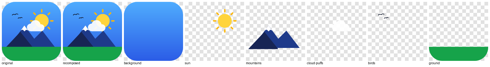
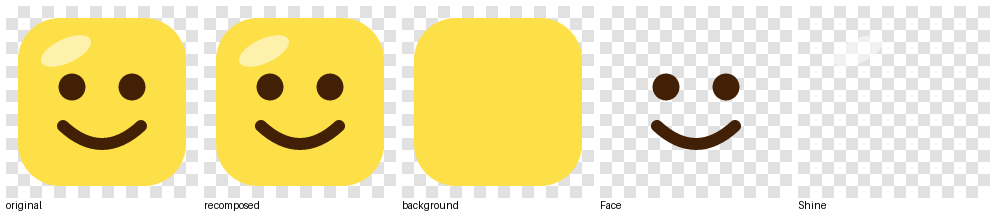
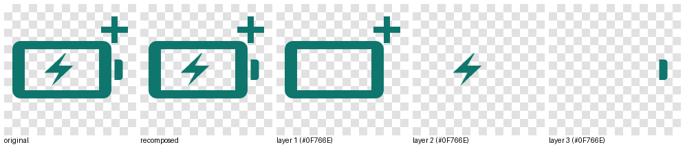
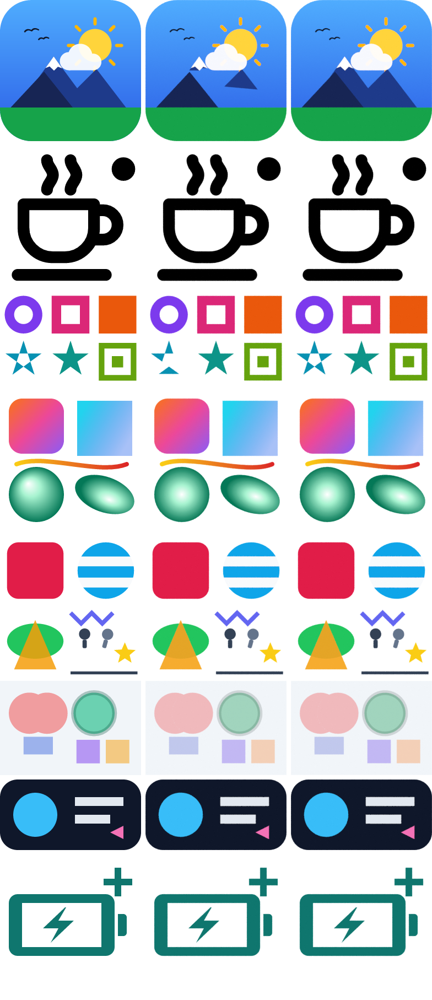

# SVG pipeline: normalizing icons, splitting them into layers, exporting geometry

> **Critic note (2026-10-03):** see [`critic-review.md`](critic-review.md) §2. The prototype was run on the real 68-icon corpus:
> - 8 icons contain fully off-canvas elements that become layers and block background detection. Culling them fixes all 8.
> - 5 icons hold embedded raster images that are dropped (Feit gives 0 layers).
> - 61 icons use filter drop-shadows.
> - Icon space must be ×2 (±1) to match PLAN.md, including the gradient recipes.
> - Layers need a `safe_radius` for bevel clamping.

*Research and prototype for Blender Icon Studio. Date: 2026-10-03. Machine: Windows 11, Python 3.13.5 venv, Blender 5.0.0 (Python 3.11.13), RTX 3070 Ti with OptiX.*

Files in this folder:

| File | What it is |
|---|---|
| `svg_prototype.py` | Working prototype: prepass, normalization, element extraction, four split strategies, spline and SVG export, CLI. |
| `blender_curve_builder.py` | Reference Blender consumer (bpy only). Builds curves from the JSON and renders them with Cycles + OptiX. |
| `svg_regression.py` | Regression harness: normalization diff, recomposition diff and spline round-trip for every test icon and strategy (resvg-py). |
| `svgtests/*.svg` | 12 original test icons (a to l), described in section 3. |
| `img/*.png` | Contact sheets and the Blender comparison render. |

---

## 1. TL;DR: decisions

1. **Normalizer: `picosvg` 0.23 + `skia-pathops` 0.9.2.** picosvg cannot take real-world SVGs directly. It needs a prepass of about 400 lines that we own (lxml). picosvg does the hard geometry: transforms baked in, shapes→paths, clip paths applied as booleans, even-odd→nonzero, and `<g opacity>` kept only where it matters. skia-pathops handles every boolean op, `simplify()` and stroking.
2. **We own the prepass.** It runs before picosvg and does these things:
   - Inline the CSS from `<style>`.
   - Expand `<use>`/`<symbol>` ourselves. picosvg rejects SVG2 `href` and `<symbol>`, and it drops ids.
   - Resolve `currentColor` and parse every CSS color.
   - Bake objectBoundingBox gradients into userSpaceOnUse.
   - Resolve `%`/unit geometry.
   - Convert **strokes to fills ourselves at ×(256/stroke-width) scale** (see point 3).
   - Stamp **provenance ids** on every leaf so metadata survives the flattening.
   - Strip unsupported features, each with a warning.
3. **Raw picosvg stroking is visibly wrong on small viewBoxes.** On a 24-unit Lucide icon, an `r=1` circle with `stroke-width=2` comes out as a squircle. The radial error is 0.12 units (6%) and the pixel error is 0.8% at 2048 px. The cause is skia's stroker, which uses a fixed absolute tolerance. Stroking a scaled-up copy brings the error below 0.001 units: 0.028% px, which is only anti-aliasing noise.
4. **Splitting runs on a z-order constraint DAG.** Any two elements that overlap fix a "below" relation. A merge is legal only if the cluster graph stays acyclic. That keeps every split recomposable: in all tests, layers rendered separately and alpha-composited match the normalized icon pixel-for-pixel. The **smart** mode works in three stages:
   - Forced units (fill+stroke, opacity groups, `<use>` instances).
   - Background-plate detection.
   - Same-paint merges (touching, or same parent group), then cost-based agglomeration down to ≤6 layers, or ≤3 for monochrome icons. Single-path glyphs are exploded into contour islands first.

   It reproduced the author's intended layers on the multi-layer and Inkscape test icons.
5. **Geometry handoff is JSON** with cubic Bezier splines (`co`/`hl`/`hr`, all FREE handles) in a normalized, y-up icon space where the longer viewBox side = 1.0. Holes come from **nesting only**, because contours are disjoint after `pathops.simplify`. For each layer the JSON carries:
   - the silhouette (union, for extrusion and glass),
   - occlusion-cut color regions (for materials),
   - a standalone same-viewBox SVG,
   - Blender-ready gradient recipes.
6. **Blender: do not use the legacy 2D curve fill. Use Geometry Nodes *Fill Curve* (CDT).** Legacy scanfill breaks whenever a hole contour touches the outer contour at a vertex, for example an even-odd pentagram, or a mountain minus a snowcap that shares its peak. Measured on the OptiX validation renders (% of pixels off by more than 48/255):

   | Icon | Legacy fill | GN Fill Curve |
   |---|---|---|
   | a | 7.8% | 0.6% |
   | c | 2.1% | 0.17% |

   Blender's Python is 3.11 with none of these libraries, so **all SVG work happens in the backend venv**.
7. **three.js:** build `THREE.Shape`s straight from the same JSON splines, so the preview geometry equals the Blender geometry. Use the per-layer SVG for textures and thumbnails, rasterized natively by the browser. Our clean per-layer SVGs also parse correctly in `SVGLoader` (three r186): areas match exactly. Note that `SVGLoader.createShapes()` is deprecated since r185, so call `shapePath.toShapes()` instead. SVGLoader reads gradients into `userData.gradients` but does not render them.
8. **Skip** `svgpathtools`: it drags in scipy (115 MB), is slow and has no boolean ops. Skip `skia-python` as well (15 MB, not needed). `svgelements` is optional. It is a nice tolerant parser, but its `Color` silently turns `rgb(255 0 0 / 50%)` into black, and it neither strokes nor clips. Use `resvg-py` for thumbnails and regression diffs.

---

## 2. Verified installs (Python 3.13.5, Windows 11, this venv)

```powershell
& ".venv/Scripts/python.exe" -m pip install picosvg skia-pathops shapely   # runtime (lxml + absl-py come with picosvg)
& ".venv/Scripts/python.exe" -m pip install resvg-py pillow numpy         # thumbnails + tests
# evaluated, not recommended:
& ".venv/Scripts/python.exe" -m pip install svgelements svgpathtools skia-python
```

All of these installed from binary wheels with no compiler: skia-pathops `cp310-abi3-win_amd64`, lxml `cp313-win_amd64`, shapely `cp313`, skia-python `cp313`.

| Package | Version | Latest upload | License | Size on disk | Verdict |
|---|---|---|---|---|---|
| picosvg | 0.23.0 | 2026-08-14 | Apache-2.0 | 0.4 MB | **use** (normalizer) |
| skia-pathops | 0.9.2 | 2026-02-16 | BSD-3 | 3.7 MB | **use** (booleans, simplify, stroke) |
| lxml | 6.1.3 | (picosvg dep) | BSD-3 | 9.3 MB | **use** (prepass) |
| shapely | 2.1.2 | 2025-09-24 | BSD-3 | 3.3 MB (+numpy) | **use** (distance/overlap analysis) |
| resvg-py | 0.5.0 | 2026-08-24 | MIT | 2.6 MB | **use** (thumbnails, tests) |
| svgelements | 1.9.6 | 2023-08-17 | MIT | 0.8 MB | optional / reference |
| svgpathtools | 1.8.0 | 2026-09-05 | MIT | 0.5 MB + scipy 115 MB | no |
| skia-python | 144.0.post2 | 2026-03-19 | BSD-3 | 15 MB | no (not needed) |

---

## 3. Test corpus (original artwork, `svgtests/`)

| File | Covers |
|---|---|
| `a_app_multilayer.svg` | 1024² app icon: gradient plate, nested `<g>` with translate/rotate/scale/skewX, 8 rotated rays, group opacity over overlapping children, stroked birds |
| `b_line_icon.svg` | Lucide-style 24×24: `stroke-width=2`, round caps/joins, `fill=none`, `currentColor`, arcs, relative + `s` shorthand, `<line>`, small stroked `<circle>` |
| `c_holes_evenodd.svg` | even-odd donut, nonzero with opposite/same winding, self-intersecting pentagram (evenodd and nonzero), 3-level nesting (island in hole) |
| `d_gradients.svg` | objectBoundingBox vs userSpaceOnUse, `gradientTransform`, radial focal point, `xlink:href` template, stop-opacity, gradient on a **stroke** with `spreadMethod=reflect`, gradient on a transformed ellipse |
| `e_primitives_use_clip.svg` | rect rx/ry, circle, ellipse, polygon, polyline, line, `<use href>` (SVG2), `<use xlink:href>` + rotate, `<symbol viewBox>` via use width/height, clip-path on a group |
| `f_opacity.svg` | group opacity with overlap, nested group opacity, fill-opacity + stroke-opacity, `rgba()`, `#RRGGBBAA`, `opacity=0`, `display=none` |
| `g_offset_viewbox.svg` | `viewBox="100 200 64 32"` (offset, 2:1), width/height ≠ viewBox |
| `h_illustrator_css.svg` | Illustrator-style `<style>` classes + `#id` rule, `Layer_1`, `enable-background`, `xml:space` |
| `i_figma_clip_wrapper.svg` | Figma-style whole-icon `clip-path` wrapper, `fill-rule/clip-rule=evenodd`, stroke partly outside canvas |
| `j_inkscape_layers.svg` | `inkscape:groupmode="layer"` + `inkscape:label`, `sodipodi:namedview`, `style=""` attributes |
| `k_unsupported.svg` | `<text>`, `<mask>`, `<filter>`, `<pattern>` fill, `stroke-dasharray`, nested `<svg>` |
| `l_single_path_glyph.svg` | icon-font-style **single compound path** with 4 islands (frame with hole, bolt inside hole, nub, plus) |

---

## 4. Library comparison: what each one does to real icons

### 4.1 picosvg used raw (`SVG.fromstring(s).topicosvg()`)

| Test | Result | Pixel diff vs original (resvg, 256 px) |
|---|---|---|
| a, c, d, f, g, i | OK | 0-0.1% |
| b (Lucide) | OK, but **stroke geometry wrong** (`r=1` circle → squircle) | 1.2% @192 px, still 0.8% @2048 px (real error, not AA) |
| e | **throws** `Only use #fragment supported` (SVG2 `href`); `<symbol>` → `BadElement` | n/a |
| h | **throws** `BadElement: /svg[0]/style[0]`; with `drop_unsupported=True` all CSS colors are lost | 72% |
| j | OK | 0.2% (stroke inaccuracy) |
| k | **throws** on `<text>`; with `drop_unsupported` it silently drops text/pattern/filter/mask | 12.6% |

These failure modes were each verified on minimal inputs:

| Input | What picosvg does |
|---|---|
| `width="50%"` | throws (`float('50%')`) |
| `fill="currentColor"` with `color="red"` on root | passes `currentColor` through and drops the root `color`, so the result renders **black** (silent) |
| `mask="url(#m)"` | **silently ignored** |
| `class`, `data-*` on `<g>` | silently dropped |
| `<rect id="keepme" fill stroke>` | becomes 2 paths **with no ids**. It also drops ids of `<use>` clones. |
| Groups | flattened, so membership is lost. Only `<g opacity>` with more than one child survives. |
| `rgba()` and `#RRGGBBAA` | passed through **unparsed** |
| Arcs | left as `A` in untouched paths |
| Stroke outlines | emitted as quads |
| objectBoundingBox gradients | **left as bbox units on untransformed shapes**. After a clip or our stroke conversion changes the bbox, the gradient would shift. We bake them first. |

What picosvg does well, and what we keep: exact transform application, including to gradients (it emits a new `gradientTransform`); clip paths as true booleans via skia; even-odd→nonzero via `simplify`; group-opacity semantics (it keeps `<g opacity>` only when it has more than one child); href gradient templates; and deterministic, absolute output.

### 4.2 svgelements 1.9.6 (`SVG.parse(reify=True)`)

Never threw on the corpus. It resolves `<style>` classes and `#id` rules, `<use>`/`<symbol>`, nested `<svg>`, `currentColor` (as black) and `rgba`/`#hex8`. But it has these gaps:

| Feature | What svgelements does |
|---|---|
| Strokes | no stroke→fill |
| Clip paths | not applied (not even propagated) |
| Gradients | fill becomes black. The raw `url()` is still available in `values`. |
| Group opacity | multiplied into children, which is wrong when children overlap |
| Boolean ops | none |
| Colors | `Color()` returns **black** for CSS Color 4 syntax (`rgb(255 0 0 / 50%)`, `hsla(200 50% 40% / .3)`) |

It is a tolerant parser but not a normalizer. Nothing in our pipeline needs it.

### 4.3 Others

| Library | Notes |
|---|---|
| **skia-pathops** | `Path.stroke`, `simplify(fix_winding)`, `op(UNION/DIFFERENCE/INTERSECTION/XOR)`, `convertConicsToQuads`, `bounds`, `transform()` (returns a new path), and iteration over raw verbs. It is fast and robust. `simplify` output is non-overlapping contours that render the same under evenodd and nonzero, which is exactly what Blender and three.js need. Gotcha: `Path.segments` iterates fontTools-pen style, gives TrueType implied points, and raises on CONIC. **Iterate the path itself** (`for verb, pts in path`) instead. |
| **shapely 2.1** | Vectorized `distance`/`intersection`/`area`, plus `make_valid`. Used only for analysis: gaps, overlaps, containment, background coverage. |
| **resvg-py** | `svg_to_bytes(svg_string=…, width=…, height=…)` returns PNG bytes. Spec-accurate. Used for every fidelity number in this doc. |
| **svgpathtools** | Pure-Python Bezier math (intersections, offsets) with a numpy+scipy dependency. No fill rules, no booleans, slow. Not useful here. |
| **skia-python** | Full Skia. It could stroke with `resScale` and render SVG, but it duplicates pathops and resvg at 15 MB. Not needed. |

---

## 5. The pipeline (as prototyped)

```
SVG text
 └─ prepass()              [lxml, ours]  secure parse (no entities/network), drop foreign-ns + title/desc/metadata
      ├─ CSS: <style> rules (type/.class/#id/descendant) by specificity, then style=""; writes attributes
      ├─ display:none / visibility:hidden removal; <a>/<switch> → <g>
      ├─ <use>/<symbol>/nested-svg expansion (x/y + viewBox→width/height transform), cycle-safe, records use_of
      ├─ unsupported: <text>/<image>/<foreignObject>/markers dropped; mask/filter attrs stripped (warnings)
      ├─ computed-style walk: inherited paint props written explicitly on every shape; currentColor resolved;
      │   colors parsed (hex3/4/6/8, rgb/rgba/hsl/hsla incl. CSS4 space+slash syntax, 148 names) → #RRGGBB + opacity
      ├─ gradients: href chains resolved, objectBoundingBox → userSpaceOnUse per element (bbox of ORIGINAL
      │   geometry), stop colors normalized; pattern/degenerate paint → solid fallback + warning
      ├─ geometry attrs: %, px/pt/mm/in, rx="auto" resolved
      ├─ stroke→fill (ours): scale×(256/width) → pathops.stroke → conics→quads → simplify → unscale;
      │   dashes, caps, joins, miterlimit; paint-order; element opacity <1 with fill+stroke → wrapped in <g opacity>
      ├─ provenance: every painted leaf gets id="e{n}" (stroke outline "e{n}s"); meta[e{n}] = original id, tag,
      │   ancestor chain (id, inkscape:label/data-name, auto-name flag, inkscape layer, use_of), index_path, role
      └─ attribute whitelist per element (picosvg-safe)
 └─ picosvg.topicosvg(ndigits=4)   transforms, shapes→paths, clip booleans, evenodd→nonzero, group flattening
 └─ extract_elements()     walk output: path id → provenance; retained <g opacity> → group_opacity + opacity_group
      ├─ paint: solid {hex, rgb} | gradient {type, coords, transform, stops, key}
      ├─ geometry: pathops.Path simplified (disjoint contours), d_clean (no self-intersections),
      │   shapely polygon (flattened at 0.05% of the viewBox diagonal) for analysis
 └─ split_layers(strategy)  → list of layers (element index lists, bottom→top)
 └─ build_layers()          → per layer: silhouette splines, occlusion-cut regions, layer SVG, names
```

Timings: 0.01-0.16 s per test icon. A synthetic 400-element icon takes 3.0 s; the O(n²) pair analysis dominates. A naive agglomeration took 64 s, so cluster stats are cached and updated incrementally, with a lazy heap.

### 5.1 Recovering per-element metadata (the key trick)

picosvg flattens groups and only carries `id` through, and it clears even that on fill+stroke shapes and `<use>` clones. So the prepass does three things:

- It removes every case where picosvg would drop ids. It splits fill and stroke itself and expands `<use>` itself.
- It stamps a synthetic `id` on every painted leaf.
- It records a sidecar `meta[uid]`:
  - `orig_id`, `tag`, `role` (`fill`/`stroke`), `base` (the shared uid of a fill+stroke pair),
  - `ancestors[]` (group id, label, auto-name flag, `inkscape_layer`, `use_of`, opacity),
  - `index_path` (position in the tree, used for group strategies and affinity),
  - `classes`, `current_color` (true when the color came from `currentColor`, so the UI can offer recoloring).

After picosvg, every output `<path id>` is looked up in the sidecar. Ids survive clip application, even-odd conversion, transforms and rounding. Verified: on all 12 test icons, every element maps back to its source.

---

## 6. Auto-split algorithm

### 6.1 The invariant: z-order consistency

Layers are stacked in depth. That is only faithful if one global order of layers reproduces the paint order wherever elements overlap.

- **Constraint graph.** For every pair `i<j` in paint order whose geometries overlap (intersection area > 1e-6 of the viewBox area), cluster(i) must sit below cluster(j).
- **Legal merge.** Merging clusters A and B is allowed only if the contracted graph stays acyclic. Equivalently, there is no path A→X→…→B or B→X→…→A through a third cluster.
- **Layer order.** The final order is a topological sort, with ties broken by mean paint index.

Non-overlapping elements impose no constraint, so they can be regrouped freely. This is what lets "same color" or "same group" merges jump over unrelated elements. It also detects "weaving", where a merge would need an element to sit both above and below a layer. Such merges are refused. Icon Composer handles weaving with manual slicing; see section 9.

### 6.2 Strategies

| Strategy | Rule |
|---|---|
| `element` | Forced units only: fill+stroke pair, retained opacity group, `<use>` instance. |
| `group` | Unwrap wrappers that every element shares (Figma clip group, Illustrator `Layer_1`), then make one layer per top-level child. Bare top-level shapes become their own layer. |
| `color` | Elements with the same paint merge, if the merge is legal (ΔE76 ≤ 6 for solids, identical stop signature for gradients, opacity within 0.05). Otherwise they split into several same-color layers. |
| `smart` | See 6.3. |

### 6.3 Smart mode

0. **Island explode.** If, apart from the background, there is a single element with several disjoint islands (icon-font glyph), split it into islands. An island is an outer contour plus its holes; an island sitting inside a hole is its own island.
1. **Forced units:** as in `element`.
2. **Background plate.** The bottom-most elements become the "background" layer if both hold:
   - the area is ≥ 45% of the viewBox,
   - at least 90% of everything painted above lies inside it.

   This layer is never merged. It maps to Icon Composer's background fill.
3. **Phase A.** Merge same-paint pairs that touch (gap ≤ 0.75% of the viewBox diagonal), closest first.
4. **Phase A2.** Merge same-paint pairs that share a non-root parent group, at any distance. This catches eyes and sun rays.
5. **Phase B.** Agglomerate the cheapest legal pair. Continue while the foreground cluster count exceeds the budget (`max_layers` 6 minus background; 3 if monochrome), or while the cheapest cost is ≤ 0.25. The cost is:

   `0.8·min(ΔE_Lab,100)/100 + 2.0·gap/diag + 1.0·(1 − group_affinity) + 0.3·|Δ mean paint index|/n`

   - group_affinity = shared ancestor depth ÷ max depth (single-linkage max over members),
   - gap = single-linkage minimum,
   - color = area-weighted mean Lab per cluster.
6. **Phase C.** If only one foreground cluster remains, split it by connected components (gap ≤ adjacency), glue the closest components until the count is within budget, and keep only splits that stay legal.
7. **Naming.** Use the deepest named group shared by all members (inkscape:label > data-name > id, skipping generator noise such as `g12`, `path3`, `Layer_1`, `clip0_…`). Otherwise use the original id(s). Otherwise use `layer N (#hex)`. Duplicate names get the id or color appended.

**Results.** All recompose exactly, with recomposition diff equal to normalization diff:

| Icon | Smart layers |
|---|---|
| a | background · **sun** (disc + 8 rays) · **mountains** (back, front, snowcap) · **cloud-puffs** (opacity group) · **birds** · **ground**. Matches the author's groups. |
| j | background (Plate) · **Face** (eyes + smile) · **Shine** |
| h | background (Badge) · Flame #F97316 · Flame / flame-core · Flame #FDE68A |
| e | tile · striped-ball (clip result, 3) · leaf · tri · zigzag + rule + 2 pip instances · star |
| f | background · group-half (opacity group, 3) · fill-op (fill + ring) · rgba · hex8 |
| b | cup + handle + steam · saucer · dot. Monochrome icons are split by proximity, so expect manual tweaks. |
| l | frame + plus · bolt · nub. Islands, then proximity; same caveat. |





Tunables live in `SplitParams`: `max_layers`, `min_layers`, `adjacency_pct`, `same_color_de`, `background_cover`, the four cost weights, `auto_merge_cost` and `explode_single_shape`. For Icon Composer parity, use **background + ≤4 groups**, i.e. `max_layers=5`. Icon Composer caps groups at 4; see `apple-icon-composer.md`.

---

## 7. Geometry and data export

### 7.1 Coordinate space

- **Icon space:** `x' = (x − cx)/S`, `y' = (cy − y)/S`, where `(cx, cy)` is the viewBox center and `S = max(vbW, vbH)`. The result is centered, y-up, with the longer side = 1.0, for both Blender and three.js.
- **Non-square viewBoxes** keep their aspect ratio; for example, g spans x ±0.5 and y ±0.25.
- **Winding flips** with the y-flip. That doesn't matter, because holes come from nesting.

### 7.2 Splines (`path_to_splines`)

Input is a `pathops.Path` after `simplify()`, so contours are disjoint, always closed for fills, and holes are purely nesting-based. Output is one cubic Bezier spline per contour:

```json
{"closed": true, "depth": 1, "hole": true, "parent": 0,
 "points": [{"co": [x, y], "hl": [x, y], "hr": [x, y]}, ...]}
```

- **Segments:**
  - LINE: handles at 1/3 and 2/3, exact.
  - QUAD: exact degree elevation (`c1 = p0 + 2/3(q − p0)`, `c2 = p1 + 2/3(q − p1)`).
  - CUBIC: as is.
  - CONIC: converted to quads first.
  - CLOSE: adds the implicit closing line when needed.
  - Zero-length segments are dropped.
- **Handles:** use Blender handle type `FREE` on both sides. Positions are exact, so straight edges stay straight.
- **`depth`/`hole`/`parent`** come from point-in-polygon tests with a probe point on the curve. Contours never cross after simplify, so this is unambiguous. three.js needs these fields (`Shape.holes`); Blender's GN Fill Curve does not.
- **Round-trip check:** splines → SVG path (`splines_to_d`), rendered with both nonzero and evenodd, against the layer silhouette. In every test, 0% of pixels differ by more than 25% coverage. Icon e shows 0.011%, a single AA pixel row.

### 7.3 Per-layer output (`build_layers`)

| Field | Purpose |
|---|---|
| `silhouette` | Union of all members as splines. Use it for extrusion, bevel, glass body and masks. |
| `regions[]` | One per member, in paint order, each `{uid, orig_id, role, paint, opacity, z_sub, splines}`. **Occlusion-cut:** a region is minus every opaque member above it in the same layer (and same opacity group), so regions of one layer are disjoint and can be one mesh with material slots. Translucent uppers are not cut; `z_sub` provides a tiny Z offset. Inside a retained opacity group, cuts use element-level opacity, because children composite before the group alpha. This fixed double-blending in f. |
| `svg` | Standalone `<svg>` with the **same viewBox**. It holds only the used gradient defs, `<g opacity>` for opacity groups, and `<path data-uid fill opacity d>`. `d` is the **simplified** path: no self-intersections, so SVGLoader, earcut and any fill rule agree. With picosvg's raw `d`, a nonzero pentagram had 2355 units² of SVGLoader area instead of 1799. |
| `bbox_svg`, `bbox_icon`, `paints`, `members`, `orig_ids`, `opacity_groups`, `name`, `is_background` | metadata for UI and thumbnails |

Top level: `view_box`, `icon_space`, `strategy`, `split_info`, `warnings[]`, `elements[]` (flat element list with provenance) and `normalized_svg`.

### 7.4 Gradients → Blender recipe (`paint.shader`)

All gradients reach extraction in userSpaceOnUse. Each is composed with the icon-space transform into a recipe that maps 1:1 onto nodes, with `P` = Texture Coordinate ▸ Object in icon space:

- **linear:** `t = dot(P.xy, dir) + offset`. Nodes: Vector Math DOT → Math ADD → Color Ramp.
- **radial:** `q = M·P.xy + m`, then `t = |q|`. Nodes: two DOTs + ADDs → Combine XYZ → LENGTH → Color Ramp.
- **Focal point:** `focal = [fx, fy]` is given in the same unit space. The exact SVG rule is `t = |d|² / (−(f·d) + √((f·d)² − (|f|²−1)|d|²))` with `d = q − f`. The test builder ignores the focal point, which accounts for d's remaining 1.9% diff.
- **Color space:** stop colors are sRGB and SVG interpolates in sRGB. The builder densifies each interval with 3 sRGB-interpolated samples, converts them to linear, and stays within the ColorRamp limit of 32 elements. Stop opacity feeds Ramp alpha.
- **spreadMethod** reflect/repeat would need ping-pong/fract nodes. Pad is a clamp. The prepass warns when reflect/repeat appears.

Solids carry both `rgb` (sRGB) and `rgb_linear` (for Blender color sockets).

---

## 8. Validation summary

| Icon | Normalization diff | Recompose diff | Spline error | Blender OptiX (GN fill) |
|---|---|---|---|---|
| a multilayer | 0.019% | 0.046% | 0% | 0.63% (legacy fill 7.8%) |
| b Lucide | 0.51% @192 px, falls to 0.028% @2048 (AA only) | 0.51% | 0% | 0.10% |
| c holes | 0% | 0% | 0% | 0.17% (legacy 2.1%) |
| d gradients | 0.10% | 0.10% | 0% | 1.86% (radial focal ignored) |
| e use/clip | 0.13% | 0.13% | 0.011% | 0.57% |
| f opacity | 0% | 0% | 0% | 14.3%: **expected**, see below |
| g offset viewBox | 0% | 0% | 0% | 1.5% (AA/noise at 16 spp) |
| h CSS, i Figma, j Inkscape, l glyph | 0% | ≤0.005% | 0% | l: 0.01% |
| k unsupported | 16.3% (text/mask/filter/pattern dropped, with warnings) | same | 0% | n/a |

Columns, all measured with resvg at 192 px unless noted:

- **Normalization diff:** % of pixels off by more than 24/255.
- **Recompose diff:** the same measure for the layer SVGs rendered separately and composited.
- **Spline error:** % of pixels with more than 25% coverage difference between silhouette splines and the layer.
- **Blender OptiX:** % of pixels off by more than 48/255 versus resvg.

**Blender validation.** `blender_curve_builder.py` was run headless with Cycles on **OptiX** (log: "Using fast to trace OptiX BVH"). Settings: 256 px, 16 spp, no denoise, `max_bounces=0`, emission + transparent shaders, orthographic top camera with `ortho_scale=1`. 16 renders including Blender startup took 21 s, and GPU memory stays tiny.



Columns in that image: resvg reference | legacy curve fill | GN Fill Curve. The legacy fill loses the mountain (row 1) and the even-odd star (row 3).

**Translucency.** The f diff is not a geometry error. Blender composites in linear light, while SVG/resvg composites in sRGB. A 50% `#7C3AED` over `#F1F5F9` renders (194,184,243) in Blender, which is exactly the predicted linear blend; resvg gives (182,151,243). This is physically correct for glass, but translucent flat art will look lighter than in a browser. If exact SVG parity matters, the UI can offer an "sRGB-look" compensation (approximate α remap) or bake translucent flat layers to textures.

**three.js.** Checked with three 0.186.1 under jsdom. `SVGLoader().parse(layer.svg)` + `toShapes()` areas equal our spline areas for every test layer. Shapes built from the JSON splines (`bezierCurveTo` + `holes` via `parent`) give identical areas.

---

## 9. Edge cases and how they are handled

| Case | Handling |
|---|---|
| `<style>` CSS (Illustrator/Figma) | Own mini-CSS: type/.class/#id/compound/descendant (`>` treated as descendant) with specificity and order. Unsupported selectors are ignored with a warning; @-rules are dropped. |
| `style=""`, `!important` | Parsed; `!important` stripped. Precedence: presentation < stylesheet < inline. |
| SVG2 `href` / `xlink:href`, `<symbol>`, nested `<use>`, missing target | Own expansion, up to 16 passes. Missing or external targets are dropped with a warning. |
| `currentColor` | Resolved from inherited `color`, else `Options.current_color` (default `#000`). Flagged in meta so line icons can be recolored. |
| Colors: hex 3/4/6/8, rgb/rgba/hsl/hsla (CSS3 and CSS4 syntax), 148 names, `transparent` | Own parser. Alpha multiplies into fill/stroke/stop opacity. |
| Fill and stroke on one element | Split into two elements, stroke above (or below with `paint-order: stroke`). Element opacity <1 → both wrapped in `<g opacity>` so the overlap band composites correctly. |
| Thin strokes on small viewBoxes | Pre-scaled stroking (see TL;DR 3). |
| `stroke-dasharray` / offset, caps, joins, miterlimit, `%` widths | skia stroker. `miter-clip`/`arcs` joins fall back to `miter`. |
| `vector-effect=non-scaling-stroke` | Warning; treated as a normal stroke. |
| Gradient on a stroke, or a clipped shape (objectBoundingBox) | Baked to userSpaceOnUse from the **original** geometry bbox before stroking or clipping. |
| Zero-size bbox + objectBoundingBox gradient (horizontal line) | Per spec the paint server is ignored. We fall back to the average stop color with a warning. |
| Pattern fills | Fallback color (the `url(#p) <fallback>` syntax, else the average child fill), with a warning. |
| `<mask>`, `filter`, markers, `mix-blend-mode` | Stripped, with a warning. picosvg alone would silently ignore masks. Shadows and blur get re-created in 3D anyway. |
| `<text>` | Dropped with "convert text to outlines". Apple's Icon Composer has the same requirement. Optional future: run `usvg` (Rust) or Inkscape CLI text-to-path upstream. |
| `<image>`, `<foreignObject>`, animation | Dropped, with a warning. |
| `display=none`, `visibility=hidden`, `opacity=0` | Removed. |
| `%`/units in geometry, `rx="auto"` | Resolved in the prepass; picosvg would throw. |
| No viewBox | From width/height (units stripped); else assume `0 0 100 100` with a warning. Offset or non-square viewBoxes keep their aspect in icon space. |
| DOCTYPE / entities / XXE | Stripped; lxml with `resolve_entities=False, no_network=True`. |
| Whole-icon clip wrappers (Figma) | Clip applied by picosvg. The `group` strategy unwraps the shared wrapper. |
| Self-intersecting paths, even-odd, touching contours | `pathops.simplify` → disjoint contours. **Blender must use GN Fill Curve** (legacy fill breaks on touching contours). |
| Single compound-path glyphs | Island explode (smart mode). |
| Weaving (A over B here, B over A there) | Merges that would create a cycle are refused, so the layer count can exceed the budget (`split_info.note`). Future: slice elements, as Icon Composer users do manually. |
| Empty SVG / only text | Zero layers plus warnings, no exception. |
| Large icons (hundreds of paths) | 400 elements → 3.0 s. Past about 1000, pre-merge by top-level group first. |

---

## 10. Recommendations for implementation

- Move `svg_prototype.py` into the backend as a package. Suggested modules: `prepass.py`, `normalize.py`, `split.py`, `export.py`.
- Keep `resvg-py` and the regression harness. The harness covers recomposition diff, spline round-trip and normalization diff on `svgtests/`. Run it as unit tests.
- Expose these UI operations: re-split with any strategy, merge/split layers manually, move an element between layers (validate with `_ClusterState.try_merge`-style cycle checks), and rename layers.
- Blender worker:
  - Use JSON splines → curve objects → GN Fill Curve (N-gons).
  - Then use GN Extrude Mesh or Solidify plus a bevel for depth. Bevel the curve itself only for the rounded-edge look.
  - Use one object per region, or join regions per layer with material indices; regions are disjoint by construction.
  - Use the silhouette for the glass body.
- Preview: build three.js shapes from the same JSON. Rasterize `layer.svg` via `` → canvas for color textures and thumbnails.
- Open items:
  - focal-radial and reflect/repeat gradients in Blender nodes,
  - optional sRGB-look compensation for translucency,
  - text-to-path,
  - element slicing for weaving,
  - smarter monochrome splitting (stroke-semantic grouping).

## 11. Sources

- picosvg: https://github.com/googlefonts/picosvg (installed source read: `svg.py`, `svg_pathops.py`, `svg_types.py`)
- skia-pathops: https://github.com/fonttools/skia-pathops
- svgelements: https://github.com/meerk40t/svgelements
- three.js SVGLoader (r186 source, `examples/jsm/loaders/SVGLoader.js`): https://github.com/mrdoob/three.js
- Icon Composer: maximum of 4 groups: https://developer.apple.com/videos/play/wwdc2025/361/ (also summarized in `apple-icon-composer.md`)
- SVG 1.1 / 2 painting, gradients, `use`: https://www.w3.org/TR/SVG2/
- PyPI release metadata queried 2026-10-03 (`https://pypi.org/pypi/<pkg>/json`).
